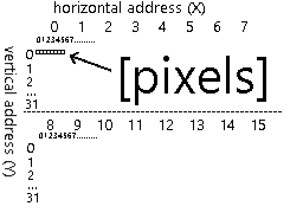
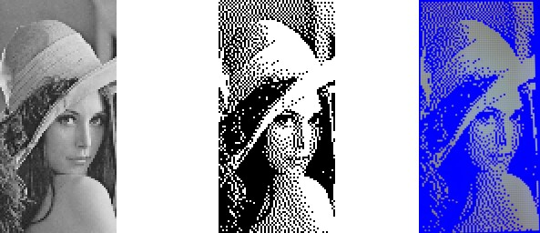
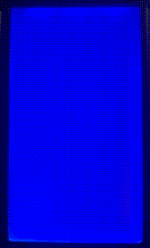

TODO animated gif of something nice(r) 

## Displaying things on a 128x64 display from an FPGA

### Text mode
The text mode on the 128x64 display was easy, as I already had sample Verilog code to tweak. 


TODO make a smaller screenshot

Source code: https://github.com/jborza/altera-12864-demo/blob/main/LCD12864.v

We display text by
- turning on the display
- setting display position
- writing ASCII bytes into data display ram 

```verilog
 reg [7:0] mem [0:63];
 reg [3:0] mem_index;

 task write_row;
	input [2:0] mem_row;
	input [5:0] next_state;

	begin
		rs <= 1;
		dat <= mem[mem_row*16 + mem_index];
		mem_index <= mem_index + 1;
		if(mem_index == 15) begin
			next <= next_state;
		end
	end
 endtask

 ...
```


## Let's do graphic mode

Let's do graphic mode! 


TODO link datasheet

The control chip on my display is ST7920, so we need to use its datasheet: https://www.waveshare.com/datasheet/LCD_en_PDF/ST7920.pdf

Naively implementing the display using old datasheet

Quartus can load memory from a text file with the following Verilog construct:

```verilog
 reg [7:0] mem [0:1023];
 ...
 initial begin;
	$readmemb("rom.txt", mem);
 end
```

The expected format looks like this (as we load it into an "array" of 8-bit values):

```
00000000
01111111
11111101
01011111
```

It means we need to convert the 128x64 monochrome picture into bits.

### Initialize the display

It also specifies that _In same instruction cannot alter DL, RE and G at once. Make sure that change DL or G first and then RE. (sic)_. I was doing this wrong, so it probably took more loops to initialize the display correctly as it was set in the wrong mode.

This also helped a bit to figure out the startup sequence: https://www.avrfreaks.net/forum/working-lcd-st7920-graphic-mode - although I had to convert C to Verilog.

### Drawing pixels

It somehow worked - but the screen was glitching and it took a while for the picture to show up.

The datasheet also specifies how long an operation is supposed to take:

| Instruction       | Exec time |
|-------------------|-----------|
| Display Clear     | 1.6 ms    |
| Function Set      | 72 µs     |
| Display control   | 72 µs     |
| Write to (GD)RAM  | 72 µs     |
| Set GDRAM address | 72 µs     |

It also describes the algorithm for writing the display as:
- set the vertical address
- set the horizontal address
- write two bytes into the GDRAM

which takes 4 cycles for every 16 pixels. However, as the data sheet also says that writing into the RAM advances the address counter horizontally, we only need to update the address at the end every row to move the counter down vertically.


### Making the display faster

A back of the envelope calculation says that the filling the entire display should take:

```
  64 (rows) * ((set vertical and horizontal address) + 128 px / 8 px/write * (write to RAM)
= 64 * (2 * 72 us + 16 * 72 us)
= 64 * 1296 us
= 82.944 ms
```

It actually took much longer - when specifying an address along with every memory write (two bytes), it took around 6 seconds to fill the display completely. It would probably make more sense once I see a real timing from simulation or an oscilloscope. 

Measurements showed that the "en" pin is triggered with a frequency 392 Hz (cycle of 2.55 ms), which made sense after better looking at the code I reused that used an overflow of a 16-bit counter, so 50 MHz / 65536 ~= 762 Hz, which divided by two is 381 Hz - roughly similar to the measurement.

As the datasheet specified execution time of 72 us, I could go much faster and ended up with 11-bit counter, yielding 12.2 KHz or 81.9 µs.


### Refactoring into Verilog tasks

Defining Verilog tasks helped to make the state machine more readable

```verilog
 task command;
	input [7:0] data;
	input [5:0] next_state;
	
	begin
		rs <= 0;
		dat <= data;
		next <= next_state;
	end
 endtask
 ..
  set0: begin command(SET_MODE_8BIT, set1); mem_index <= 0; y <= 0; x<=0; end 
  set1: begin command(DISPLAY_ON_CURSOR_OFF_BLINK_OFF, set2); end // display on       
  set2: begin command(SET_MODE_GRAPHIC, set3); end // extended instruction set
  set3: begin command(SET_MODE_GRAPHIC, data0); end //graphic mode on
```


### Figuring out the display addressing mode

I later realized that the address actually works as if it were a 256x32 display, sliced into two 128x32 slices, which are placed on top of each other to form a 128x64 screen with a weird addressing. That means the ROM generation code just needed to be reworked.



### Generating picture data ROM 

Converting the picture to the RAM with a Python code

```python
from PIL import Image
# assuming 1bpp 64x128 png
im = Image.open('lenna.png')

def print_row(y):
    #get 8 bits at a time
    for x in range(0,128,8):
        byte = 0
        for x_offset in range(0,8):
            if(x_offset > 0):
                byte = byte << 1
            px = im.getpixel((x+x_offset,y))
            byte = byte | px
        print(f'{byte:08b}')

for y in range(0,32):
    #interlace rows Y and Y+32
    print_row(y)
    print_row(y+32)
```


In the spirit of computer science camaraderie, I used the standard [Lenna test image](https://en.wikipedia.org/wiki/Lenna). By cropping it to 128x64 pixels, applying dithering it was good to get encoded to a ROM:



_original, dithered ROM source, photo of the display_

And a GIF of the rendering on the board (the display memory starts up uninitialized):



It should be easy to clear the display after powering on, so the image doesn't start rendering from random values in the RAM.

### What did I learn in Verilog

**Tasks** are useful for repeating code, they are analogous to void functions in programming. They can interact with "global" wires and registers and accept parameters as well.

**Parameters** can be used similarly to constants in programming languages instead of magic numbers.

```verilog
parameter SET_MODE_8BIT = 8'b00110000;
```

Verilog **automatically extends signal width**, so one of the bugs down the way was missing a zero. VHDL is strict with types and doesn't let you do this.

```verilog
parameter y_initial = 8'b1000000;
//was meant to be     8'b10000000, 
//got converted into  8'b01000000;
```

We can *load the initial state of a memory* from a file in Quartus:

```
initial begin;
	$readmemb("rom.txt", mem);
end
```

### The code

Hosted with ❤️ on GitHub:
https://github.com/jborza/lcd-12864-graphic
