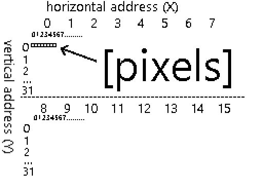
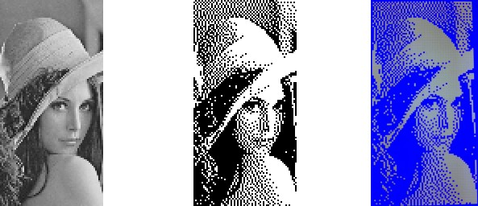
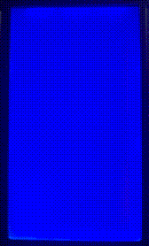

# Displaying things on a 128x64 display from an FPGA

One of my FPGA boards came with a connector for a parallel-interface 12864 display, so I ordered one online, soldered 20 pins, used sample code provided by the vendor and it lit up. 

However, I was not really happy with using the display just for 4 lines of text, as I like pictures, and end up with something like this.


## Text mode
The text mode on the 128x64 display was easy, as I already had sample Verilog code to work with. 


### How does it work?

We display text by
- turning on the display
- setting display position
- writing ASCII bytes into data display ram 

#### A naive approach

This can be done in a simple way - describing a state machine with a state for every character and iterating through the states until it's all written out.

```verilog
    ...
    set6:   begin  rs<=0; dat<=8'h98; next<=dat23; 

    dat23:   begin  rs<=1; dat<="F"; next<=dat24; end 
    dat24:   begin  rs<=1; dat<="P"; next<=dat25; end 
    dat25:   begin  rs<=1; dat<="G"; next<=dat26; end 
    dat26:   begin  rs<=1; dat<="A"; next<=nul;   end 
```

See the full module: https://gist.github.com/jborza/b6ed20ad809ddac717295da006ad68ba

### Generating a ROM

It would be much easier to just load the data we want to display from a file into some kind of memory structure.

Quartus can load a memory from a text file with the following Verilog construct:

```verilog
 reg [7:0] mem [0:63];
 ...
 initial begin;
	$readmemb("rom.txt", mem);
 end
```

The expected format contains literal ones and zeroes to be loaded into the memory (8-bits as we load it into an "array" of 8-bit values):

```
00000000
01111111
11111101
01011111
```

Then we can define a Verilog task such as this to prepare the data output for the display and advance the x offset.

```verilog
 reg [7:0] mem [0:63];
 reg [3:0] mem_index;
 reg [3:0] x;

 task write_characters_row;
	input [2:0] y;
	input [5:0] next_state;

	begin
		rs <= 1;
		dat <= mem[y*16 + x];
		x <= x + 1;
		if(x == 15) begin
			next <= next_state;
		end
	end
 endtask
```

And then use it in in a simplified state machine (`command` task sends a specific command to the display controller)

```verilog
...
always @(posedge clk_display)
...
set3: begin command(SET_8BIT_BASIC_INSTR, row0); x <= 0; end
row0: begin write_characters_row(0, move_to_row1); end
move_to_row1: begin command(line1, row1); x <= 0; end 
row1: begin	write_characters_row(1, move_to_row2); end
...
```

Which is a bit nicer than explicit 

Source code for this ROM-backed text mode module: https://github.com/jborza/altera-12864-demo/blob/main/LCD12864.v

## Graphic mode

Let's do graphic mode now! 

As the control chip on my display is ST7920, so we need to take a look at its [datasheet](https://www.waveshare.com/datasheet/LCD_en_PDF/ST7920.pdf) to see how do we initialize the graphic mode and send pixel data to the screen.

### Initializing the display

The datasheet specifies an order of instructions, which I got wrong on the first try, as some of the instructions can only change one setting bit at a time. ( _In same instruction cannot alter DL, RE and G at once. Make sure that change DL or G first and then RE. (sic)_). 

It also helped to look at some [C code in forums online](https://www.avrfreaks.net/forum/working-lcd-st7920-graphic-mode) - I can still read C faster than VHDL or Verilog.

As the ST7920 supports basic and extended instruction modes, it turned out one I had to execute commands in both modes. 

### Verilog tasks to the rescue

Defining Verilog tasks helped to make the state machine more readable as well.

```verilog
 task command;
	input [7:0] data;
	input [5:0] next_state;
	
	begin
		rs <= 0;
		dat <= data;
		next <= next_state;
	end
 endtask
 ..
  set0: begin command(SET_MODE_8BIT, set1); mem_index <= 0; y <= 0; x<=0; end 
  set1: begin command(DISPLAY_ON_CURSOR_OFF_BLINK_OFF, set2); end // display on       
  set2: begin command(SET_MODE_GRAPHIC, set3); end // extended instruction set
  set3: begin command(SET_MODE_GRAPHIC, data0); end //graphic mode on
```

### Drawing pixels

The datasheet describes the algorithm for displaying graphics on the display as:
- set the vertical address
- set the horizontal address
- write two bytes into the GDRAM (with two consecutive writes)

> Note that the above which takes 4 cycles for every 16 pixels. However, as the data sheet also says that writing into the RAM advances the address counter horizontally, we only need to update the address at the end every row to move the counter down vertically.

That means we need to convert the 128x64 monochrome picture into bits, load these bits on into some kind of ROM in the design and iterate over the ROM.

I wrote a ROM generator in Python as well, but the first version was incorrect because I didn't read the display addressing part of the datasheet correctly.

### Figuring out the display addressing mode

I realized after a couple of hours that the address actually works as if it were a 256x32 display, sliced into two 128x32 slices, which are placed on top of each other to form a 128x64 screen with a weird addressing. That means the ROM generation code just needed to be reworked.



### Generating picture data ROM 

Converting the picture to the RAM with a Python code

```python
from PIL import Image
# assuming 1bpp 64x128 png
im = Image.open('lenna.png')

def print_row(y):
    #get 8 bits at a time
    for x in range(0,128,8):
        byte = 0
        for x_offset in range(0,8):
            if(x_offset > 0):
                byte = byte << 1
            px = im.getpixel((x+x_offset,y))
            byte = byte | px
        print(f'{byte:08b}')

for y in range(0,32):
    #interlace rows Y and Y+32
    print_row(y)
    print_row(y+32)
```

### All of it  together 

In the spirit of computer science camaraderie, I used the standard [Lenna test image](https://en.wikipedia.org/wiki/Lenna). By cropping it to 128x64 pixels, applying dithering it was good to get encoded to a ROM:



_original, dithered ROM source, photo of the display_

And a GIF of the rendering on the board (apologies for the noise, the display memory starts up uninitialized):



### Making the display faster

As you can see from the gif, it's **really slow** - takes around 6 seconds for the entire screen.

The datasheet specifies how long an operation is supposed to take:

| Instruction       | Exec time |
|-------------------|-----------|
| Display Clear     | 1.6 ms    |
| Function Set      | 72 µs     |
| Display control   | 72 µs     |
| Write to (GD)RAM  | 72 µs     |
| Set GDRAM address | 72 µs     |

A back of the envelope calculation says that the filling the entire display should take:

```
  64 (rows) * ((set vertical and horizontal address) + 128 px / 8 px/write * (write to RAM)
= 64 * (2 * 72 us + 16 * 72 us)
= 64 * 1296 us
= 82.944 ms
```

As seen on the gif, it actually took much longer - it made more sense once I saw a real timing from an oscilloscope. 


The "en" pin is triggered with a frequency 392 Hz (cycle of 2.55 ms), which made sense after better looking at the code I reused that used an overflow of a 16-bit counter, so 50 MHz / 65536 ~= 762 Hz, which divided by two is 381 Hz - roughly similar to the measurement.

As the datasheet specified execution time of 72 us, I could go much faster and ended up with 11-bit counter, yielding 12.2 KHz or 81.9 µs per operation. With 1152 ticks per screen refresh we can redraw the screen at around 10 frames per second, which is nice.

### What did I learn in Verilog

**Tasks** are useful for repeating code, they are analogous to void functions in programming. They can interact with "global" wires and registers and accept parameters as well.

**Parameters** can be used similarly to constants in programming languages instead of magic numbers. (`localparam` in Verilog 2001)

```verilog
localparam SET_MODE_8BIT = 8'b00110000;
```

Verilog **automatically extends signal width**, so one of the bugs down the way was missing a zero. VHDL is strict with types and doesn't let you do this.

```verilog
parameter y_initial = 8'b1000000;
//was meant to be     8'b10000000, 
//got converted into  8'b01000000;
```

We can **load the initial state of memory** from a file in Quartus:

```
initial begin;
	$readmemb("rom.txt", mem);
end
```

### What's next

Of course this is not a very useful real world example - you would typically want to display changing data on the display, so it would need to be backed by memory

I'd like to modify this into a display controller component that displays could be reused in a project

### The code

Hosted with ❤️ on GitHub:
https://github.com/jborza/lcd-12864-graphic
