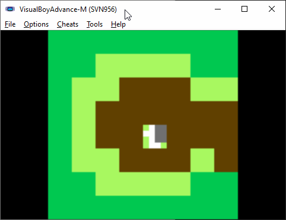
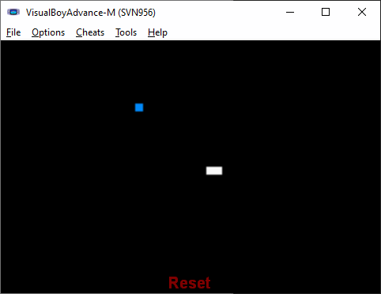

## Introduction

Back in April 2019 I decided to get into emulation and thought about writing a simple one. I read about the [MOS 6502 microprocessor](https://en.wikipedia.org/wiki/MOS_Technology_6502) and it looked promising as it was used in famous products such as Apple II, Commodore 64, BBC Micro, Tamagotchi and others. 

One would typically program this in the 6502 assembly, for more information check out the wonderful [Easy6502 interactive ebook](https://skilldrick.github.io/easy6502/) by Nick Morgan, it includes an emulator as well.

The MOS 6502 is interesting to program from the 2019 viewpoint, as it has only 3 registers and 64 KB of memory divided into pages. The first 256 bytes of the memory are special, it's called the 'zero-page' and can be accessed faster than the rest.

Sample 6502 code:
```nasm
LDA #$10
STA $a0
LDY #$03
STA $0200,X
INX 
DEY 
BNE $0606
DEC $a0
LDA $a0
BNE $0604
```

## Emulation

I eventually ended up with a working 6502 emulator, hosted here on Github as [emu6502](https://github.com/jborza/emu6502). Emu6502 is written in C, has a hand-written [test-suite in 6502 machine code](https://github.com/jborza/emu6502/blob/master/test6502.c), was developed mostly in Visual Studio 2019, but compiles with gcc and emscripten as well. 

The emulator itself is simple - it operates over a [state structure](https://github.com/jborza/gba-6502/blob/master/source/state.h) with the values of CPU registers, memory and flags. There is an instruction decoder implemented as a [giant switch statement](https://github.com/jborza/gba-6502/blob/1ba10dadc54422b841f35b1bad82db8a26468060/source/cpu.c#L374) and implementation of each [instruction handler](https://github.com/jborza/gba-6502/blob/1ba10dadc54422b841f35b1bad82db8a26468060/source/cpu.c#L97).

## Getting some output

The CPU on its own isn't that useful, as we need some way to handle input and output. Simple hardware usually has memory-mapped I/O, so the controller buttons could appear at some memory location, and when one writes to another memory location, the video chip would pick this up and display it. I looked around for similar projects and found [6502asm](http://www.6502asm.com), self-titled "World's first fantasy console!". 

The specification of the fantasy console is quite simple - 32x32 pixels of 16 colors each, input handled by sending ASCII code to address `$FF` and random generator output at `$FE`. Memory locations `$200` to `$5FF` map to the screen pixels. No sound, sprites or other console niceties. The advantage of going for an existing 'platform' is that I had plenty of available projects ready as people developed some cool things against `6502asm`, so I would not have to develop my own games on top of the emulator. 

The initial run of emu6502 was done in a Windows console window, which is not so nice to look at and I thought about porting this to an actual console with a screen and buttons. 

I like Nintendo hardware, so I ended up with two ports - both Nintendo consoles - Game Boy Advance and the 3DS. 

## Game Boy Advance port

Code lives here: [gba-6502](https://github.com/jborza/gba-6502).

For homebrew development I used the excellent [devkitPro toolchain](https://devkitpro.org/). 

## Graphics

The Game Boy Advance has a couple of graphic modes, we're using [Mode 3](https://www.coranac.com/tonc/text/bitmaps.htm), which is a bitmap mode, with a resolution of 240x160. The colors are stored in a palette, see [color.c](https://github.com/jborza/gba-6502/blob/master/source/color.c)

The second GBA-specific module is in aptly named [`main.c`](https://github.com/jborza/gba-6502/blob/master/source/main.c). This module handles rendering - which is extremely simple:

```c
void draw_memory()
{
    for (int y = 0; y < 32; y++)
    {
        for (int x = 0; x < 32; x++)
        {
            //160x160 - 5x5 px box per pixel
            draw_square(x*PIXEL_SIZE+SCREEN_OFFSET_LEFT, y*PIXEL_SIZE, PIXEL_SIZE, get_color(state.memory[0x200 + x + y * DISP_WIDTH]));
        }
    }
}
```

What does this mysterious draw_square do? Unfortunately there is no 2D drawing library, so it just draws individual pixels...

```c
inline void draw_square(int x, int y, int size, int color)
{
    for (int yy = 0; yy < size; yy++)
        for (int xx = 0; xx < size; xx++)
            vid_mem[(y + yy) * SCREEN_WIDTH + x + xx] = color;
}
```

...into the video memory

```c
#define MEM_VRAM 0x06000000
#define vid_mem ((u16 *)MEM_VRAM)

inline void draw_point(int x, int y, int clr)
{
    vid_mem[y * SCREEN_WIDTH + x] = clr;
};
```

```c
palette[0] = 0x0;
palette[1] = 0x7fff;
palette[2] = 0x11;
palette[3] = 0x77f5;
```

To obtain this palette, Python script helped convert 32-bit hexcodes into 16-bit:

```python
palette = ["#000000", "#ffffff", "#880000", "#aaffee",
      "#cc44cc", "#00cc55", "#0000aa", "#eeee77",
      "#dd8855", "#664400", "#ff7777", "#333333",
      "#777777", "#aaff66", "#0088ff", "#bbbbbb"]

i = 0
for r,g,b in [(int(color[1:3],16), int(color[3:5],16), int (color[5:7],16)) for color in palette]:
    gba_color = (((r >> 3) & 31) | (((g >> 3) & 31) << 5) | (((b >> 3) & 31) << 10))
    print(f'palette[{i}] = {hex(gba_color)};')
    i = i+1
```

### Loading a game binary

Unfortunately the GBA doesn't have a flash memory to store the individual game ROMs, so I had to use the following workflow to add a game binary:

_how to run your own binaries_
1. Compile binaries with [6502js](https://jborza.github.io/6502js/) - develop, assemble, click `binary`.
2. Convert binary into a C hex array with `gen/gen_bin_c.py`
3. Paste hex array into `load_bin_from_memory` in `emu_gba.c`
4. Adjust the size of the binary in `load_bin_from_memory` (see the memcpy call)

Basically we'd end up with something like this for a simple program.

```c
void load_bin_from_memory(){
    char bin[] = {0xa9,0x2,0x85,0x1,0xa9,0x3,0x85,0x3,0xa9,0x4,0x85,0x5,0xa9,0x5,0x85,0x7,0xa9,0x33,0x85,0x10,0xa9,0xaa,0x85,0x11,0xa4,0xfe,0xa5,0xfe,0x91,0x0,0x4a,0x4a,0x4a,0x4a,0x4a,0x4a,0x4a,0x91,0x2,0x5,0x11,0x91,0x4,0xa6,0xfe,0x86,0x20,0x5,0x20,0x91,0x6,0x4c,0x18,0x6};
    memcpy(state.memory + PRG_START, bin, 54);
}
```

Once we have the binary loaded in the program state (a buffer of 65336 bytes), the program counter pointed at the PRG_START (0x600), the emulation can progress as usual - code flowing, checking for user input and flipping bits in the video memory, which we need to somehow render.

There are two modules that are specific to Game Boy Advance - the emulator loop, ROM loading from memory (see above) and input handling in [`emu_gba.c`](https://github.com/jborza/gba-6502/blob/master/source/emu_gba.c), 

```c
void emu_tick(){
    state.memory[0xFF] = last_key & 0xFF;
	state.memory[0xfe] = rand() & 0xFF;
    if(state.flags.b != 1)
	    emulate_6502_op(&state);
}
```

### Key handling

It seems I have forgotten to actually *implement* reading of the keys to send to the emulator. The 6502js games typically expect the `wsad` keys, so it would be nice to convert the native GBA keycodes into those. As a refresher, I wrote a quick program to display the keycode as a "bar length". 

```nasm
define currentKey $ff
define lastKey $2

loop:
;load last pressed key into X, compare with last key
ldx currentKey
cpx lastKey
;if the key is the same as the last time, loop again
beq loop

;store the new lastKey
stx lastKey
;clear screen on new key
lda #0
ldy #255
clear:
sta $0200,y
dey
bne clear

;change color based on the key code
lda lastKey
;draw a bar the length of the key code
key_loop:
;loop from key code down to 0
STA $0200,X
dex
;while x > 0
bpl key_loop
jmp loop
```

To actually read the keys one should call `scanKeys();` to obtain the keypad state and then call the `keysDown()` function to get the keys that have been pressed, as documented in devkitPro [`gba_input.h`](https://github.com/devkitPro/libgba/blob/master/include/gba_input.h). 

We can do this in the VblankInterrupt function, which is an interrupt raised on every frame, assigning the value from `keysDown()` into the global last_key variable, which we stuff into the 0xff zero-page memory location on every emulator tick.

```c
void VblankInterrupt()
//---------------------------------------------------------------------------------
{
    frame += 1;
    scanKeys();
    last_key = keysDown();
}

int main(void)
{
    ...
    // Set up the interrupt handlers
    irqInit();

    irqSet(IRQ_VBLANK, VblankInterrupt);

    // Enable Vblank Interrupt to allow VblankIntrWait
    irqEnable(IRQ_VBLANK);

    // Allow Interrupts
    REG_IME = 1;
    ...
```

With this code we obtain *some key code*, but not in the format that the `emu6502` games expect (WASD ASCII key codes). 

The keys are actually defines as:

```c
typedef enum KEYPAD_BITS {
	KEY_A		=	(1<<0),	/*!< keypad A button */
	KEY_B		=	(1<<1),	/*!< keypad B button */
	KEY_SELECT	=	(1<<2),	/*!< keypad SELECT button */
	KEY_START	=	(1<<3),	/*!< keypad START button */
	KEY_RIGHT	=	(1<<4),	/*!< dpad RIGHT */
	KEY_LEFT	=	(1<<5),	/*!< dpad LEFT */
	KEY_UP		=	(1<<6),	/*!< dpad UP */
	KEY_DOWN	=	(1<<7),	/*!< dpad DOWN */
	KEY_R		=	(1<<8),	/*!< Right shoulder button */
	KEY_L		=	(1<<9),	/*!< Left shoulder button */

	KEYIRQ_ENABLE	=	(1<<14),	/*!< Enable keypad interrupt */
	KEYIRQ_OR		=	(0<<15),	/*!< interrupt logical OR mode */
	KEYIRQ_AND		=	(1<<15),	/*!< interrupt logical AND mode */
	DPAD 		=	(KEY_UP | KEY_DOWN | KEY_LEFT | KEY_RIGHT) /*!< mask all dpad buttons */
} KEYPAD_BITS;
```

So let's cheat and look at the individual bits. 

The fixed input routine:

```c
void handleKeys(){
    scanKeys();
    u16 kDown = keysDown();
    if (kDown & KEY_LEFT)
        last_key = 'a';
    else if (kDown & KEY_DOWN)
        last_key = 's';
    else if (kDown & KEY_RIGHT)
        last_key = 'd';
    else if (kDown & KEY_UP)
        last_key = 'w';
}
```

To test the entire tool I chose the lazy option and used a GBA emulator. I suppose it should run on a device as well, but right now I don't own any GBA flash carts ☹️.

### Performance

To make this run reasonably fast, the emulator executes 256 ticks between frames (found empirically.) Ideally one would measure how fast the emulation actually is keeping in mind the 59.7 fps on the Game Boy Advance, but one was too lazy to find this out, as the entire GBA port was done in one afternoon. 

```c
while (1)
{
    for (int i = 0; i < 256; i++)
        emu_tick();
    draw_memory();
    VBlankIntrWait();
}
```

# Screenshots

gba-6502 running a `breakout` demo:


gba-6502 running the `adventure` game.



gba-6502 running the `snake` game.



As you can see, I'm a bad Snake player when played on a console on a console 🙂.