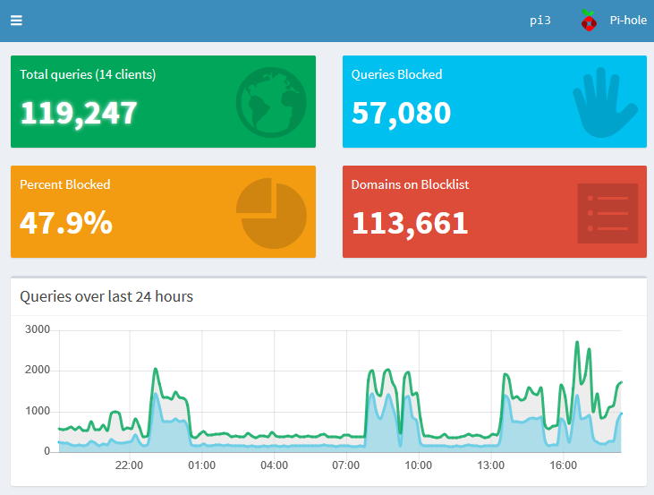

I don't like online ads too much. The easy option on a computer is to use an adblocker, but on some devices you are out of options (smart TV, or mobile games with in-game ads).
I have started using [Pi-hole](https://pi-hole.net) about 2 months ago on my home network to block ads and tracking across the entire home network, on all devices. 
Pi-hole is a self-titled black hole for internet advertising, as it acts as a DNS server and blocks requests on a name resolution lavel, based on a blacklist.
s
## Pi-hole on the go

I'd like to use Pi-hole on my phone also outside my home Wi-Fi. As I happen to host my services in the Azure public cloud, I decided to set up a small Ubuntu server instance and install Pi-hole on it.

I set up a machine in Azure with Ubuntu 18.04 LTS, decided to go for HDD storage as it's cheaper. I use a bigger instance during the setup process, for example D2s v3 (2 vcpus, 8 GiB RAM), then scale down once everything works. I'm currently running Pi-hole and pivpn in the B1s (1 vcpus, 1 GiB RAM) size, which costs 7.08 EUR per month. It could work also in the B1ls size (1 vCPU, 512 MB RAM), which costs 3.58 EUR in my Azure region.

The following settings needed to be applied:

- assign a public static IP
- create inbound rules for DNS (TCP port 53)
- inbound rule for OpenVPN (UDP port 1194 and TCP port 943)
- SSH inbound from my home network (TCP port 22)
- HTTP/S inbound from my home network (TCP port 80 and 443)
- automatic shutdown to off, as we don't want this machine to turn off

The installation of pi-hole is straightforward, as per the [official documentation](https://docs.pi-hole.net/main/basic-install/)

    curl -sSL https://install.pi-hole.net | bash
    
If you want to use Pi-vpn as well, remember to set Pi-hole DNS to **listen on all network interfaces**, otherwise the requests from the OpenVPN adapter will not get through.

I used the CloudFlare DNS server (1.1.1.1) for the Azure Pi-hole, it's also possible to run your own DNS server (unbound) for a bit more request caching.

### Testing the DNS server

A simple sanity check is to use `nslookup github.com 127.0.0.1` to check whether you can resolve github.com via the local (127.0.0.1) DNS server. 

When this works, we can repeat this on a remote computer with `nslookup github.com PIHOLE_PUBLIC_IP`. If this doesn't work, check Azure inbound port rules in the Networking screen for your VM if you haven't missed the rule for TCP port 53. 

## Pi-vpn (OpenVPN) configuration

Unfortunately it's not possible to just change the DNS server on an iPhone for requests done on a cellular network. A recommended way is to set up a VPN profile that will handle the DNS requests. We already have a Linux box, so we can set up a VPN server on it as well.

Installing pi-vpn is straightforward, as per the [official site](https://pivpn.dev/):

```bash
curl -L https://install.pivpn.dev | bash
```

We should point the DNS to the **OpenVPN** IP address of the pihole server. If you need to change this later, look at `/etc/openvpn/server.conf`  

```bash
# Set your primary domain name server address for clients
push "dhcp-option DNS 10.8.0.1" 
```    

Then generate a profile with `openvpn add`, transfer the .ovpn profile to your computer with `scp` and upload it securely to your phone / device.

## Pi-hole at home

Just skip the Pi-vpn part and install Pi-hole on a Raspberry Pi as intended. It works nicely on a Pi Zero as well. Keep in mind that frequent writes if you enable full logging can use up your micro SD card write cycles sooner. 

It's also easier to fine-tune a local network Pi-hole if you use static DHCP address assignments and then enter those hostnames into the `/etc/hosts` file. 

## Screenshot

Pi-hole dashboard (lots of requests when the home devices are active!)

