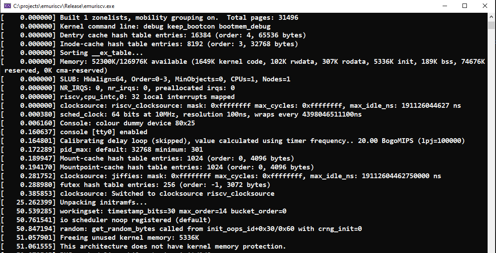

A friend told me about a cool new open-source instruction set architecture called [RISC-V](https://en.wikipedia.org/wiki/RISC-V) (pronounced risk-five). As I wanted to learn more about the architecture, I decided writing an [RISC-V emulator (emuriscv)](https://github.com/jborza/emuriscv/) would make sense. One of my goals include running a Linux on it, much inspired by Fabrice Bellard's awesome [JSLinux project](https://bellard.org/jslinux/). 

I initially started using the same 32-bit RISC-V Linux image as per Bellard's [technical notes](https://bellard.org/jslinux/tech.html), but I needed to add some of my own code for debugging purposes. As RISC-V is already supported by the official Linux Kernel, and the [Buildroot](https://buildroot.org/) project provides a nice framework for cross-compiling a complete and bootable Linux environment, I used it as a starting point. 

## What to build

We'll be building the:
- **cross-compiler toolchain** to build the rest of the software
- **buildroot environment**
- **bootloader** - BBL bootloader, it's the most simple one I found
- **Linux kernel** - Used my fork of [riscv-linux](https://github.com/jborza/riscv-linux/tree/emuriscv-linux-4.15) at emuriscv-linux-4.15

## The target platform

**emuriscv**'s architecture is rv32ima - `RV32I` is the default integer instruction set, `M` are the integer multiplication and division instructions and `A` is the extension for atomic instructions.

As I haven't implemented the floating point instructions yet, we'll also be using `ilp32` ABI for 32-bit soft-float.

It's a single core, so the atomic operations have been easy to implement :).

### Note on emuriscv binaries

**emuriscv** can't handle elf binaries, so we strip the binaries with `objcopy` to make a raw binary from an elf one:

`riscv32-unknown-linux-gnu-objcopy -O binary vmlinux vmlinux.bin`

To prepare debug symbols (to correlate in-emulator instruction pointer to the source code) I used `objdump`:

`riscv32-unknown-linux-gnu-objdump -t vmlinux.elf > vmlinux-symbol.s`

_This step needs be done for bbl and linux kernel._

## Cross-compiler toolchain

First thing you need is a compiler toolchain. The official one is called [riscv-gnu-toolchain](https://github.com/riscv/riscv-gnu-toolchain), the documentation is good.

To compile and build riscv-gnu-toolchain for rv32ima you need to:

1. clone the repository as per the readme
2. install the prerequisities as per the readme
3. build the cross-compiler
   - `./configure --prefix=/opt/riscv32 --with-arch=rv32ima --with-abi=ilp32`
   - `make newlib`
   - `make linux`
4. place the newly built tools on path (I decided for `/opt/riscv32`):
   - `PATH=/opt/riscv32/bin:$PATH`
5. define the RISCV variable to point at the toolchain 
   - `export RISCV=/opt/riscv32`

## Buildroot

Buildroot provides us with a complete embedded linux "distribution". We need to build against the rv32ima architecture.

I needed a buildroot that's able to compile against 4.15 kernel, used [buildroot-riscv-2018-10-20](https://bellard.org/tinyemu/buildroot.html), obtained from Bellard's buildroot notes.

!!!! TODO elaborate on the configuration !!!!

I went for no extra packages, busybox should be enough for the time being.


### File system without supporting storage devices

To not have to deal with a file system, devices and file system drivers, there is a neat option to generate a ramdisk filesystem image (initramfs) and then include that into the kernel binary image. 

There is an option of using uncompressed or compressed file system image. The minimal-ish buildroot initramfs ended up being 16 MB in size, compared to a gzipped version at 5.3 MB.

Decompressing with a debug build of emuriscv took much longer (minutes) than just loading the bigger uncompressed image, so the uncompressed image is faster for debugging. The differences with a release build are much smaller, as the decompression runs relatively quickly.

## Bootloader

Inspired by JSLinux, I used Berkeley Boot Loader (bbl), which is a supervisor execution environment, designed to host the RISC-V Linux port.

It's hosted in the [riscv-pk](https://github.com/riscv/riscv-pk) repository.

### Build instructions:

```bash
git clone https://github.com/riscv/riscv-pk
cd riscv-pk
mkdir build
cd build
../configure --prefix=$RISCV --host=riscv32-unknown-elf
make
make install
riscv32-unknown-linux-gnu-objcopy -O binary bbl bbl.bin
```

After making a raw binary as described above, we end up with `bbl.bin` as our target artifact.

## Kernel

I have used riscv-linux @ 4.15 as my starting point. My changes are collected in the fork of [riscv-linux](https://github.com/jborza/riscv-linux/tree/emuriscv-linux-4.15)


#### Kernel build configuration

Setting up the kernel options for as simple as possible - everything off, network support, security, most of the devices as well.

The most important being platform selection to even start the boot process:

Base ISA: RV32I, no compressed instrictions, no SMP, no FPU support.
Networking support can also be off.

The important devices were:
- RISC-V SBI console support (in Device drivers->Character devices)
- SiFive Platform-Level Interrupt Controller 

A nice-to-have for diagnosing the boot process is enabling "Show timing information on printks", "Enable dynamic printk() support", and setting the highest log levels in the "printk and dmesg options" section.

Also don't forget to check "early printk" option for writing the kernel log output to our "serial device" (using SBI ecalls).

Including the buildroot initramfs filesystem is done via the General setup -> Initial RAM filesystem and RAM disk support - point to a `rootfs.cpio` or `rootfs.cpio.gz` file system image built by buildroot in its `output/images` folder.
  
#### Required patches

The RISC-V SBI console is set up as a boot console, which should be used for early boot only and will get deactivated after the virtual memory system is initialized due to where it's loaded in the "initial data" memory. Removing the `CON_BOOT` flag and the `__initdata` modifier loads it into the memory in a way that it persists as an early and "later" console.

### Build instructions

0. clone the repository
1. set up environment variables
- `export RISCV=/opt/riscv32`
- `export PATH=$PATH:$RISCV/bin`
- `export CCPREFIX=riscv32-unknown-linux-gnu-`
2. prepare the kernel configuration
- `make ARCH=riscv CROSS_COMPILE=$CCPREFIX defconfig`
- `make ARCH=riscv CROSS_COMPILE=$CCPREFIX nconfig`
3. build
- `make ARCH=riscv CROSS_COMPILE=$CCPREFIX vmlinux`

### Post-build tasks

Make raw binary and debug symbols with:

```console
riscv32-unknown-linux-gnu-objcopy -O binary vmlinux vmlinux.bin
riscv32-unknown-linux-gnu-objdump -t vmlinux.elf > vmlinux-symbol.s
```

## Loading the binaries and booting

BBL is loaded at the address 0x80000000. The CPU starts executing code at 0x1000.
We place the flattened device tree (FDT) at 0x1040.
Kernel usually ends up loaded at 0x00400000.

We place the following bits of machine code at 0x100:

```bash
# $jump_addr = 0x80000000;
# $dtb is the device tree base = 0x1040
# mhartid is 0 as 
auipc t0, $jump_addr
auipc a1, $dtb
addi a1, a1, $dtb
csrr a0, mhartid
jalr zero, t0, $jump_addr
```

Then BBL proceeds on to set up the supervisor mode and goes on to start the Linux boot process.

I've used the following command line (bootargs) options:
`debug keep_bootcon bootmem_debug`

