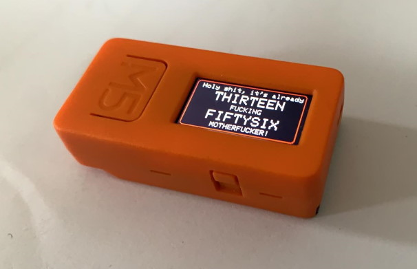

I bought the [M5StickC ESP32 mini IoT development kit](https://m5stack.com/products/stick-c) and wanted to do a fun project. Some of the kits come with a wristband, the board features a real time clock module, so it could also work as a wristwatch. 

I've seen a fun picture once that had a smart watch saying:

```
    Holy shit, it's already 
    _TEN_ 
    FUCKING 
    _FORTYFOUR_ 
    MOTHERFUCKER
```

and thought that won't be hard to implement on the M5StickC. [Arduino IDE](https://www.arduino.cc/en/main/software) works well for this kind of projects.

## Reading the current time

The M5 stick has a real time clock, which we can read using `M5.Rtc.GetTime(RTC_TimeTypeDef *timeStruct)

```c
RTC_TimeTypeDef RTC_TimeStruct;
M5.Rtc.GetTime(&RTC_TimeStruct);
```

## Setting the current time

An example in the documentation did show how to set the time manually, so that's what I did, with a reference time from the computer and a steady hand at the reset button :) 

``` c
RTC_TimeTypeDef time;
time.Hours   = 08;
time.Minutes = 23;
time.Seconds = 30;
M5.Rtc.SetTime(&TimeStruct);
```

A better way is to sync to an NTP server. To do that, we need to connect the M5Stick to the WiFi:

``` c
#include "time.h"
#define NTP_SERVER "de.pool.ntp.org"
#define TIME_ZONE_OFFSET_HRS 2 
...
WiFi.begin(ssid, password);
while (WiFi.status() != WL_CONNECTED) {
    delay(500);
}

configTime(TIME_ZONE_OFFSET_HRS * 3600, 0, NTP_SERVER);
struct tm timeInfo;
if (getLocalTime(&timeInfo)) 
    setRtcTime(timeInfo); // ends up back in M5.Rtc.SetTime
```

## Drawing the time

We have straightforward functions to draw text wherever we want on the screen:

```c
M5.Lcd.setCursor(0,34);
M5.Lcd.println("Hello, world!");
```

If we want to display the text as English numerals, we need some code. I did initially consider the lazy way out and write a script in Python to produce the entire array of sixty numbers, but took the high road instead and wrote it in C. I think a reasonable way to implement this is to split the numberals into "simple" ones (up to twenty) that have no tens-prefix, and those above twenty, and handle the "tens" part separately.

```c
char *simple_digits[] = { "ZERO", "ONE", "TWO", "THREE", "FOUR", "FIVE",
  "SIX", "SEVEN", "EIGHT", "NINE", "TEN", 
  "ELEVEN", "TWELVE", "THIRTEEN", "FOURTEEN", "FIFTEEN", 
  "SIXTEEN", "SEVENTEEN", "EIGHTEEN", "NINETEEN", "TWENTY"};

char *tens_digits[] = {"", "", "TWENTY", "THIRTY", "FORTY", "FIFTY",
                              "SIXTY", "SEVENTY", "EIGHTY", "NINETY"};
                              
void formatNumber(int number){
  if(number < 20){
    sprintf(buffer, "%s", simple_digits[number]);
  }
  else{
    int tens = number / 10;
    int remainder = number % 10;
    if(remainder == 0)
      sprintf(buffer,"%s", tens_digits[tens]);
    else
      sprintf(buffer, "%s%s", tens_digits[tens], simple_digits[remainder]);
  }
}
```

## Refreshing only when required

It's nice to avoid redrawing screen if possible. We really only need to update screen if the current minute changes, so we can update the retrieve-time-and-refresh code with:

```c
M5.Rtc.GetTime(&RTC_TimeStruct);
if(RTC_TimeStruct.Minutes != lastMinute){
  M5.Lcd.fillScreen(BLACK);  
}
lastMinute = RTC_TimeStruct.Minutes;
```

## Centering the text

Due to the docs being a bit disorganized, I haven't realized there is a way to center text horizontally. Hence I thought I would need to measure the size of the font - making a simple on-screen grid with vertical lines and drawing a text with the monospaced font. Fiddling with the vertical line spacing helped me discover the character width to be 13 pixels.

```c
#define FONT_WIDTH 13
M5.Lcd.println("0123456789012");
M5.Lcd.println("THIRTYTHREE");
M5.Lcd.setCursor(0, 0);
for(int x = 0; x < 160; x += FONT_WIDTH){
  M5.Lcd.drawLine(x, 0, x, 80, RED);
  M5.Lcd.setCursor(x, 70);
  M5.Lcd.setTextSize(1);
  M5.Lcd.print(x/10);
}
```

Then I would need to measure the text length with `strlen()` or something and calculate the margin from the left in order to center the text.

**However**, it turns out there **is** a function `setTextDatum` in the M5stack LCD documentation. It sets the text position reference point, the default being `TL_DATUM` (top center). If I want to center a text horizontally, I can use the constant `TC_DATUM` (top center). However, one should use `M5.Lcd.drawString(const char *string, int32_t poX, int32_t poY)` to draw text using the alignment.

This way, I can center stuff with:

```c
M5.Lcd.setTextDatum(TC_DATUM);
M5.Lcd.drawString(buffer, CENTER, 16);
```
## Adjusting brightness and button logic

Maybe we want to adjust the brightness. The [documentation] (https://github.com/m5stack/m5-docs/blob/master/docs/en/api/axp192_m5stickc.md) for the AXP192 power management module mentions a function `void ScreenBreath(uint8_t brightness);` with a range between 7 to 12.

Let's toggle brightness levels between a low, medium, high on a button press with a series of conditionals: 

```c
#define BRIGHTNESS_LOW 8
#define BRIGHTNESS_MID 10
#define BRIGHTNESS_HIGH 12

int brightness = BRIGHTNESS_MID;

void toggleBrightness(){
  if(brightness == BRIGHTNESS_LOW)
    brightness = BRIGHTNESS_MID;
  else if(brightness == BRIGHTNESS_MID)
    brightness = BRIGHTNESS_HIGH;
  else
    brightness = BRIGHTNESS_LOW;
  M5.Axp.ScreenBreath(brightness);
}
```

The [button documentation](https://github.com/m5stack/m5-docs/blob/master/docs/en/api/button.md) includes multiple helper function for determining the button state, the simplest one being `uint8_t wasPressed()`, which returns 1 only once each time the button is pressed.

We need to update the button states with `M5.update();` and then poll the button A (the big button for `wasPressed`). 

In code:

```c
M5.update();
if (M5.BtnA.wasPressed()) {
  toggleBrightness();
}
```

It also means we should call the `loop()` function more often, as we'll lose the button presses if it sleeps for an entire second, as the M5.update() will poll the button state.


A better way would be to loop the button polling more frequently, while the timer should be polled less frequently in order to save CPU cycles. We can solve this by extracting the entire time update logic into a function, have a countdown timer that decrements each tick in the Arduino `loop()` function and calls the watch logic less frequently.

```c
#define TIMER_TICKS_MAX 10
int timer_ticks = -1;

void loop() {
M5.update();
if (M5.BtnA.wasPressed()) {
  toggleBrightness();
}
if(timer_ticks-- <= 0){
  timer_ticks = TIMER_TICKS_MAX;
  update_time(); //the extracted time update function
}
delay(100);
}
```

## The watch

Imagine a bracelet going around it, I've yet to 3D print one :)



## The code
The complete repository is available on GitHub: https://github.com/jborza/m5stick_watch_rude
