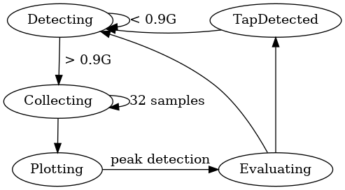
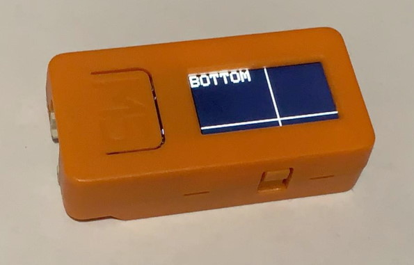

# Detecting directional taps on M5Stick-C

As M5Stick only has three buttons, I'd like to prototype a control scheme based on accelerometer either by tilting or tapping the device from the sides.

Maybe we can reliably detect "directional" taps on a device in order to move a cursor by tapping the device from its sides.


## Detecting any tap

Detecting a single tap can be done by sampling the accelerometer often enough checking if the result (conveniently in Gs) is over a threshold.

```c
  while(1) {
    M5.IMU.getAccelData(&accX,&accY,&accZ);
    if (accX > 1.5 ||  accY > 1.5 ) {
      break;
    }
  }
```

See the official [M5StickC Dices example](https://github.com/m5stack/M5StickC/blob/master/examples/Games/Dices/Dices.ino) for the full source.

## Detecting a directional tap

Getting a sense of direction is harder, as there will be a movement on two axes (X and Y) at once. We're ignoring the Z axis and treating the device as if laying flat on a desk and getting tapped from one of four sides (left/right/top/bottom side).

### Collecting the data

A naive collecting program logging the output to Arduino IDE serial plotter would collect the accelerometer output of m5stick and output the values over serial port to be captured by the serial plotter:

```c
float accX, accY, accZ;
...
M5.IMU.getAccelData(&accX,&accY,&accZ);
Serial.print(accX);
Serial.print(",");
Serial.println(accX);
```

Unfortunately there was some overhead outputting the floats to the `Serial.print` routine, so I converted them to integers and discarded the empty values. 

```c
x = (int)(accX * 1000.0f);
y = (int)(accY * 1000.0f);
//clamp
if(x < 100 && x > -100)
    x = 0;
if(y < 100 && y > -100)
    y = 0;

sprintf(buffer, "x:%d y:%d\n",x,y);  
Serial.print(buffer);
```

In the end it was better to collect the data into some kind of a buffer continuously and then output the data later.

### Data capture findings

The following plot describes the measurements obtained from the accelerometer after directional taps. The Y axis contains acceleration in Gs.


From that we can build a table that shows which axis was impacted the most by a directional tap.

| Tap direction | Change
| ---| ---
| Top    | +X
| Bottom | -X
| Left   | +Y
| Right  | -Y

> Note that there could be two peaks that indicate a recoil of the tap.

### Implementation

The following diagram describes the implementation as a state machine transitioning between the following states:



We can to determine the direction (X/Y) by seeing which axis was hit the hardest (the tallest peak) by comparing the absolute value of the x/y peak. Direction (positive/negative) could be determined by looking at the sign of the peak sample.

We also would need a buffer (ring or linear) to store the last N samples if we want to record continuously. We should start collecting data into the buffer as soon as a pulse arrives, the pulse being a certain amount of Gs. Then we should collect N samples to collect the full signature of the tap on both X and Y axes. 

I chose a sampling frequency of roughly 1 kHz, by adding a 1 millisecond delay between sample collections and using 32-sample buffer as the accelerometer settles after a couple of milliseconds after a tap.

The most interesting piece is the *evaluation function*. It 
- finds the maximum and minimum value in the buffer for both axes
- finds the first peak using absolute value of the previous min/max values
- compares maximum absolute values for x/y axis to determine the direction
- looks at the sign of the peak to determine the direction

```c
void evaluate_sample(){
  //find the max and min of each axis
  float maxX = 0, maxY = 0, minX = 0, minY = 0;
  
  for(int i = 0; i < SAMPLE_COUNT; i++){
    maxX = MAX(maxX, bufferX[i]);
    minX = MIN(minX, bufferX[i]);
    maxY = MAX(maxY, bufferY[i]);
    minY = MIN(minY, bufferY[i]);
  }

  //find the first peak by comparing abs() of X and Y
  float maxAbsX = 0, maxAbsY = 0;
  maxAbsX = MAX(maxX, fabs(minX));
  maxAbsY = MAX(maxY, fabs(minY));

  //the result - direction of x/y (only one axis active, gets value of 1/-1)
  int dx = 0, dy = 0;

  //x peak
  if(maxAbsX > maxAbsY){
    dx = maxX > fabs(minX) ? 1 /* TOP */ : -1 /* BOTTOM */;
  }
  //y peak
  else{
    dy = maxY > fabs(minY) ? 1 /* LEFT */ : -1 /* RIGHT */;
  }
}
```

> #### How other people do it
>
> While googling on how to do that, a guide to an unrelated chip https://www.nxp.com/docs/en/application-note/AN3919.pdf described a similar algorithm.

### Timers

To do this in a real application we probably can't just keep collecting and evaluating samples at 1 kHz, as it would use a lot of CPU time that could be better used for application logic or rendering. 

We can use [EP32 hardware timers](https://docs.espressif.com/projects/esp-idf/en/latest/esp32/api-reference/peripherals/timer.html) instead. See a [sample gist](https://gist.github.com/masterdezign/16ca2a55c76ab5bd639af0b7d3709b02) for implementation and a [tutorial at techtutorialsx.com](https://techtutorialsx.com/2017/10/07/esp32-arduino-timer-interrupts/).

## The code

See the full Arduino sketch code on GitHub: https://gist.github.com/jborza/4b8648ec583c2ef3b42fa1361ed4fbfa

M5Stick-C being tapped:


