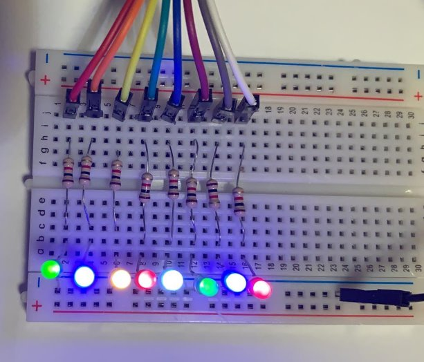

## Why more LEDs?

During the process of developing a 4x4 keypad reader I realized I need more LEDs for diagnostic information. As my [Elbert v2](https://numato.com/product/elbert-v2-spartan-3a-fpga-development-board) has plenty of digital input/output pins, it should only be a matter of wiring the LEDs to the IOs.

External LEDs should be connected serially through a resistor - otherwise, if connected directly, they will draw as much current as they can and will burn (hopefully sacrificing themselves to save the development board 🙂).

### Determining the resistor value

I admit upfront that I picked a 1 kΩ resistor out of laziness(and I couldn't find any 330 Ω ones in my resistor bag).

To do it properly, one should calculate the resistor value as 

> Resistor value [Ω] = (Supply voltage [V] - LED forward voltage [V])  / desired LED current [A]

Forward voltage of the LEDs (measured across the illuminated ED with a voltmeter):

| Color | Vf |
| --- | --- | 
| Red | 1.71
| Blue | 2.57
|Green | 1.88
|Orange | 1.88 
|White | 2.60

The pin voltage is 3.3V, the forward voltage of my LEDs ranges from 1.71 to 2.6 V, so according to Ohm's law:

```
# red LED (dimmest) at 1.59 mA
R = V/I = (3.3V - 1.71V) / ??? A = 1000Ω
1.59V / 1.59 mA = 1000 Ω 

# white LED (brightest) at 2.6 mA
2.6V / 2.6 mA = 1000 Ω 
```

## Connecting to the Elbert V2 board

I used the P2 [Pmod header](https://en.wikipedia.org/wiki/Pmod_Interface) as my P1 header is already occupied by the keypad. That meant declaring the pins 3-8,10,11 (according to the datasheet) in my `.ucf` file as.

```vhdl
NET "led_ext[0]"           LOC = P10   | IOSTANDARD = LVCMOS33 | SLEW = SLOW | DRIVE = 12;
```

## Lighting the LEDs

A short VHDL module builds up the logic to illuminate the LEDs on a button press.

```vhdl
entity top_module is
    Port ( Clk : in  STD_LOGIC;
           led_ext : out  STD_LOGIC_VECTOR(7 downto 0);
           button0 : in  STD_LOGIC);
end top_module;

architecture Behavioral of top_module is
begin
	process(clk) begin
		if rising_edge(clk) then
			for i in 0 to 7 loop
				led_ext(i) <= not button0;
			end loop;
		end if;
	end process;
end Behavioral;
```

## The result

Now I have eight more LEDs for debugging, with some space to add eight more on this breadboard if necessary!

