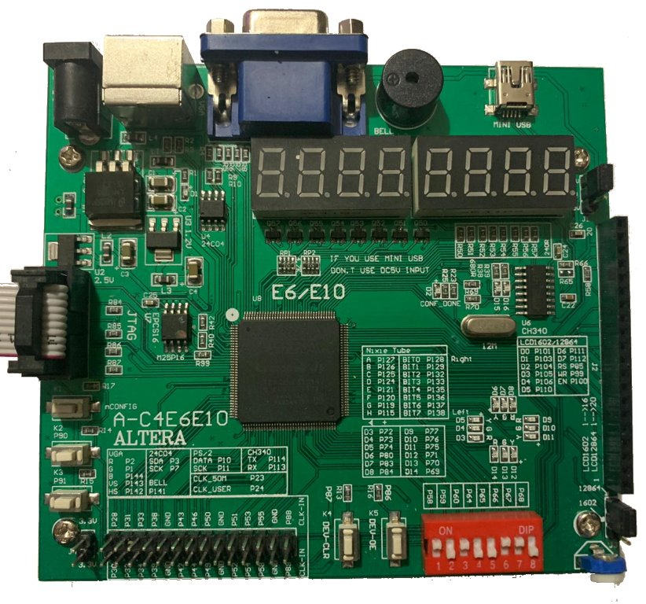
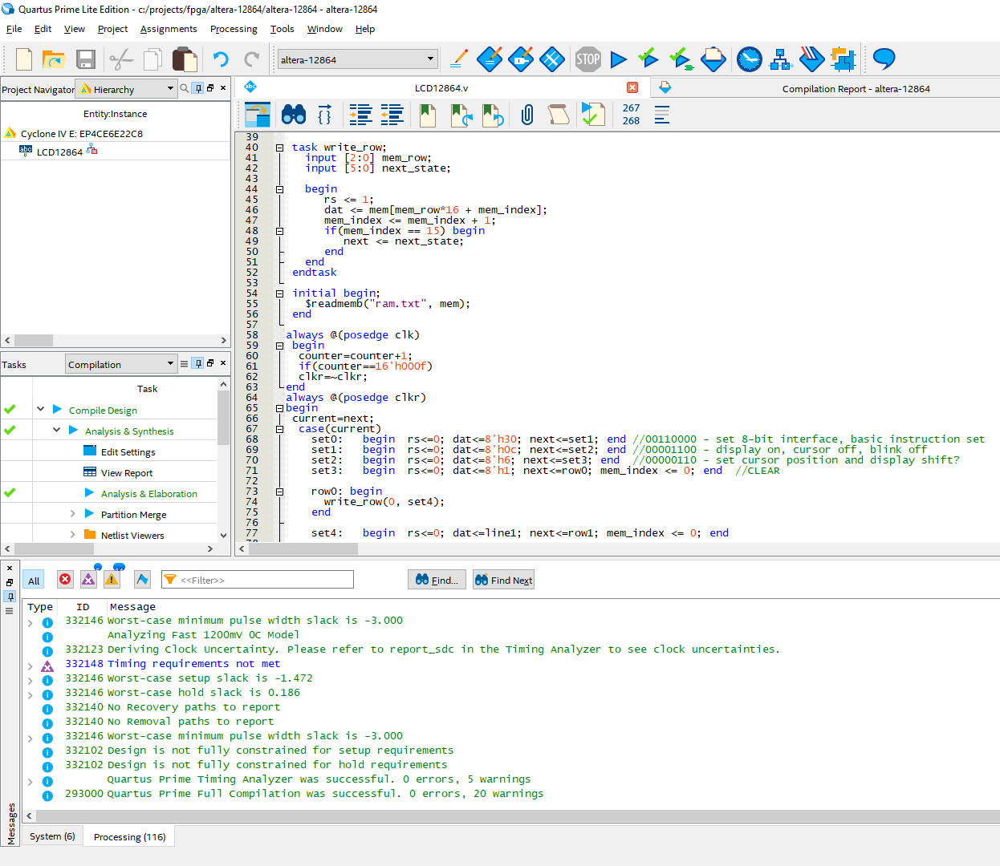
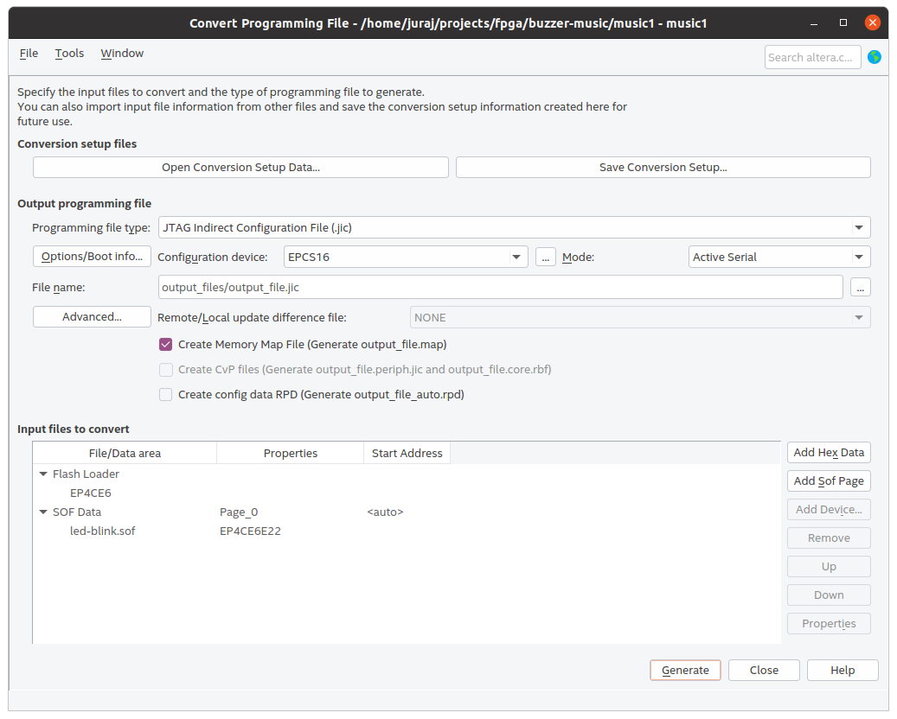
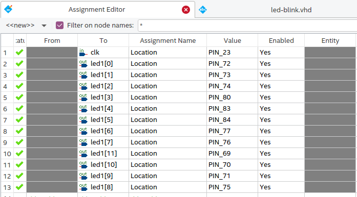
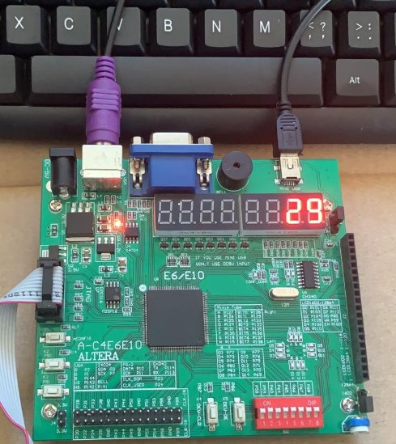

Over a month ago I bought an Altera Cyclone IV board from a local seller, it seems to be [listed on Aliexpress](https://www.aliexpress.com/item/4001125259366.html) as well. It's marked as A-C4E6E10, and features:
- Altera Cyclone IV EP4CE6E22C8 FPGA chip with 6272 logic elements, 270 Kbits of memory
- 8-digit seven-segment LCD display
- 8 position DIP switch
- VGA output
- PS/2 input port (comes in handy to try out keyboard processing)
- buzzer
- a couple of push buttons
- a handful of IO pins, some of which can be used as a connector for a 1602/12864 display and 22 miscellaneous pins
- CH340 USB to serial chip

> 1602 display has 2 lines of 16 characters, each 5x8 pixels
> 12864 dot matrix display has a resolution of 128x64 pixels, hence the name

It also came packaged with a programming dongle called USB Blaster that looks very shabby, but works.

## Software installation

I have registered on Intel download center and downloaded and installed [Quartus 20.1 Prime Lite](https://fpgasoftware.intel.com/20.1/?edition=lite&platform=windows) along with ModelSim and Cyclone IV device support.

_Quartus 20.1 with some Verilog code in it_

I've also downloaded a support package specific to this board from an [AliExpress seller's page](https://www.aliexpress.com/item/32813736111.html) that's selling the same device. It's also a good idea to archive such pages and the software packages as they're likely to disappear forever one day. The documentation consists mostly of huge Word documents with photos, it doesn't look very professional, but it's better than nothing.

The package from seller also contains several sample `.sof` (SRAM Object File) files, which is a binary format used by the board programmer. I wanted to load them on the device, one needs to use Quartus Prime Programmer to do that, with the USB blaster connected between the computer and the board. The board obviously needs to be powered on by a separate micro USB cable.

## Driver installation

After installing the drivers the blaster shows up as "Altera USB-Blaster" on my computer. That's nice, but the Quartus Programmer doesn't see the USB blaster in the devices list. I wasn't able to get this working on Windows 10 at all, so I tried installing the same under Linux (Ubuntu 20) and there the USB Blaster installed almost on its own. The programmer was still complaining about a broken JTAG chain, which can be confirmed by a command line tool `jtagconfig -d` - found in the Quartus `bin` directory. Following advice online, I had to link a different version of the `libudev` library with `ln -s /lib64/libudev.so.1 to /lib64/libudev.so.0`

## Testing bitstreams

After that I was able to upload the testing `.sof` files to the board and was greeted by blinking lights - so yes, it works. As opposed to my [Elbert V2 Xilinx dev board](), uploading the configuration to the FPGA chip and the on-board flash chip are two distinct operations, so I'm yet to find a way on how to make my changes persist through the Altera board being powered off. 

> Note: The FPGA boards usually contain a flash chip to store the configuration for the chip that loads from this flash memory on powerup. During development, one can reconfigure the FPGA chip's SRAM through the JTAG interface, bypassing a need to rewrite the flash memory and power cycle the board.

This can be done using File->Convert Programming File, selecting the input `.sof` file and producing an output `.jic` file, which can then be uploaded to the flash using the Programmer tool.

## Blinking some LEDs on my own

> I'm sure I'll read this section in the future when trying to figure out how to program this board.

### Creating a new project in Quartus.

 I had to specify the EP4CE6E22C8 chip. I also have to find a way to add a pin assignment file (recycling one from the Chinese archive by using Assignments->Import Assignments). 

_Pin assignment in Quartus assignment editor_

Luckily, the board is annotated with pin locations corresponding to IOs such as LEDs, clock and other pins.

_Pin annotations on the board_

With the LED and clock assignments completed, I was able to write a simple "Hello World" spinning LED code.

To produce the output bitstream, we can compile the project with the "Start compilation" button, and program the board using the Programmer tool (exactly the same as programming the pre-made `.sof` files previously).

## Other peripherals

### Displays

I was able to connect the 1602 and 12864 displays and test them with the bitstreams provided by the vendor. The board provides a jumper to to switch between 3.3V and 5V voltages, which is cool, as 5V displays were cheaper and easier to find in my location. There's also a knob to adjust the contrast of the connected screen.

_The display connected to the board. Apologies for my wonky soldering job, I really don't like that activity._

Here's the [sample VHDL code](https://gist.github.com/jborza/1831f69983af6ec0e48bbf32ce7229e2) for the 1602 display.

The 12864 display kind of surprised me, as it's gigantic - 3.2 inches - compared to the more modestly sized OLED screens I have been using with Arduino and ESP32 boards.

Refactoring the sample code was fun, I used the [datasheet](https://www.exploreembedded.com/wiki/images/7/77/QC12864B.pdf) to figure out what the hex codes actually meant and I also learnt some more Verilog. [Here's the modified sample code](https://github.com/jborza/altera-12864-demo/blob/main/LCD12864.v) for the 12864 display in the text mode.

_This LCD screen is just huge._

> Note: I had to adjust the pin type for _nCEO: Use as regular I/O_ in Quartus as the pin was colliding with the LCD data 0 pin (P101) - you can set this in Device and Pin options or in the .qsf file as `set_global_assignment -name CYCLONEII_RESERVE_NCEO_AFTER_CONFIGURATION "USE AS REGULAR IO"
`

### Buzzer

Using the fpga4fun.com [Music box tutorial](https://www.fpga4fun.com/MusicBox1.html) was a fun way to try out the buzzer. It sounds a bit screechy, it could be a fun project to combine it with other inputs, for example the keyboard.

### PS/2 Keyboard

Although I had to buy a cheap PS/2 keyboard to test out this port, a sample VHDL file to display the scan code on the display showed weird output. The mapping to the display segments was incorrect in the sample file, so I fixed it and was able to see the scan code on the display: `29` is generated by the space bar.

Code of this PS/2 demo [is available on GitHub](https://github.com/jborza/altera-c4-ps2demo/blob/main/keyboard_test.vhd), there's also a much nicer VHDL version available on [digikey eewiki](https://www.digikey.com/eewiki/pages/viewpage.action?pageId=28278929).

## A fun future project

This does look like a fun board to implement a toy CPU on. There's some block RAM available, a variety of IOs to be memory mapped (serial port, PS/2 input, buzzer, text buffer or diagnostics via the LCD screen and VGA out). With 6k logic elements a modestly sized 6502 or RISC-V core should fit alongside drivers for at least some of the peripherals.