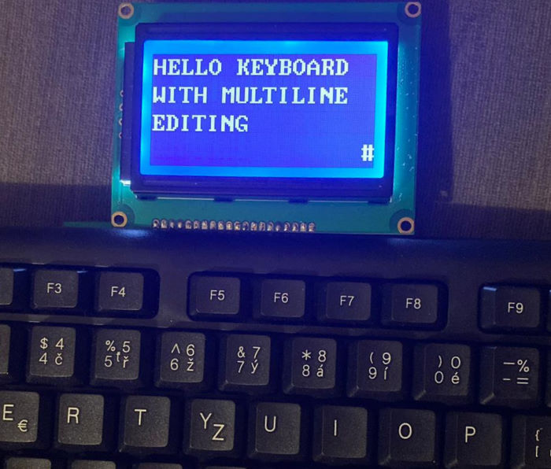
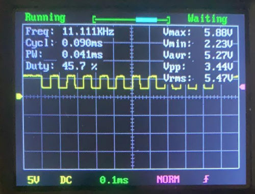
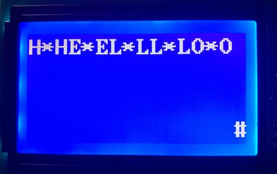
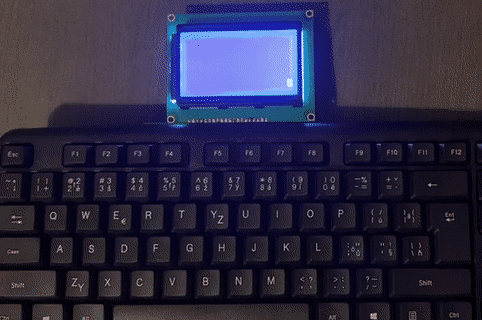

```
What will we do with a drunken keyboard?
What will we do with a drunken keyboard?
What will we do with a drunken keyboard?
Early in the morning!
```
_A sea shanty from early 19th century_

After I implemented a display of memory-mapped display in the 
[Adventures in hardware, part 6 - Stopwatch memory mapped LCD controller]() I wanted to play with the LCD display a bit more. I also got a PS2 keyboard, and it felt that these two go together.

So join me in attempting something that might be impractical in actual engineering scenarios: an electronic typewriter, where the words you type are shown on the screen. 



_Preview of the final project_

## Handling the PS2 protocol

The transmitting device (keyboard or mouse) triggers the clock at range 10-16.7 kHz, then these bits come over the data pin, on the each falling edge of the PS2 clock:
- 1 start bit
- 8 data bits
- 1 parity bit
- 1 stop bit

This [assignment](https://students.iitk.ac.in/eclub/assets/tutorials/keyboard.pdf) describes a simple approach to collecting the data, triggered by the `@negedge clk` and just collecting 8 data bits and ignoring others in an 11-state state machine.



_PS2 clock pin waveform captured on an oscilloscope_

It was a bit of a nuisance to try to capture the PS2 clock on oscilloscope. Again, reading the specs more correctly could have left me less surprised, as it explicitly states that the clock signal is generated only when there is some data coming down the wire.

### PS2 receiver

If we want to play nice with the rest of the system, we should encapsulate the protocol into a PS2 receiver module with the following interface (as per this [article](http://www.zaphinath.com/ps2-receiver-module-for-vhdl/)):

```verilog
module ps2_rx (
	input wire clk, reset,
	input wire ps2d, //PS2 data
	input wire ps2c, //PS2 clock
	input wire rx_en, //receiver enable
	output reg rx_done_tick, //signal that data is available
	output wire [7:0] dout //PS2 scancode
);
```

> Note that I didn't come up with the PS2 receiver code on my own, but looking at various implementations online showed me different approaches to handling the input and the states.

We can then connect this module to the rest of the system by using the `rx_done_tick` signal. In this case I directly move the received scancode through a converter into ASCII code  (by the following [Verilog module](https://github.com/jborza/fpga-ps2-typewriter/blob/master/key2ascii.v)) into the display RAM, which is later shown on screen.

This is what happened when I typed "hello" on the keyboard:



_The * symbol stands for unknown scancode_

### PS2 Make and break codes

Hm, not really what I expected. Looking at PS2 protocol again, it operates with a concept of make (_press_) and break (_release_) codes, so a scancode for `H` (`0x48`) is sent first when it's pushed, then the "break code" `0xF0` is sent when it's released, followed. by the scancode of `H` (`0x48`) again. 

> This is a bit more complicated for special keys, such as alt, arrow keys, home, end, etc which have multi-word make codes.

In case the `H` key is held, it generates code sequence `48 48 48 48 ... F0 48`.

Of course, when you hold `A` and press `B`, then release `B` and then release `A`, you'll get a sequence of make codes for A, B, break code for B and break code for A.

| Key      | Make  | Break    |
|----------|-------|----------|
| A        | 1C    | F0,1C    |
| B        | 32    | F0,32    |
| Backspace     | 66    | F0,66    |
| L Shift  | 12    | F0,12    |
| Enter    | 5A    | F0,5A    |
| Left ←     | E0,6B | E0,F0,6B |
| Numpad 4 | 6B    | F0,6B    |
| Home     | E0,6C | E0,F0,6C |
| Numpad 7 | 6C    | F0,6C    |
| Pause    | E1,1D,45,E1,9D,C5 | -None - |


In this simple typewriter case, let's pretend that we're not interested in the keyboard key released event.

It also so happens that the last word of multi-word make codes usually correspond to an alternate version of the key on the regular keyboard. So the left arrow ← has the same code `6B` as Keypad 4 `E0,6B`, which on my keyboard has a left arrow pictured on it.

It means that we probably can get away with interpreting just the last word of the make code and get the meaning of the most right, if we pretend the numeric part of the keyboard doesn't exist.

## Improvements
### Handling only the key press, not release

We should upgrade our keyboard driver by adding another module around it, that handles keypresses. It has a new output: `makeBreak`, which will output 1 for make and 0 for break code. Then in the top module we can handle these situation separately - by ignoring the scancode with the break code flag completely.

`E0` seems to be followed by a single scan code, `E1` seems to be followed by two scan codes.

> There are some weird keys with long scancode sequence: Pause: `E1 1D 45 E1 9D C5`, Print screen: `e0 2a e0 37`. I'll pretend these don't exist. 

I named the new module `ps2_keypress_driver`, it actually ignores the events if they come in with the break codes.

It also advances the address of the byte being written into the memory, so now as we type `HELLO` it stores the corresponding ASCII codes `48 45 4C 4C 4F`, and they get displayed.

```verilog
//write current ascii code into $current_address and advance the address by 1
write_address <= current_address;				
ram_in <= ascii_scan_data;	
current_address <= current_address + 1;
we <= 1'b1;
```
### Implementing backspace

Let's say we also want to delete something we already typed on backspace key press.  

The implementation ended up hacky - moving the "cursor" back and overwriting the memory with a blank space:

```verilog
if(ascii_scan_data == BACKSPACE) begin
    write_address <= current_address - 1;
    ram_in <= SPACE;
    current_address <= current_address - 1;
end 
```

### Implementing newline (enter)

To make the virtual cursor move to a new line after pressing the `Enter` key, we basically want to advance the memory pointer to the nearest multiple of 16.

We can do that by dividing by 16, incrementing by one and multiplying back by 16.

```verilog
current_address <= (((current_address >> 4) + 1) << 4);
```

Note: I know that having multiple `if` statements to handle special key logic feels strange and kludgy, I feel it too and know that there must be a better way to structure the logic. 

## The complete product, demonstration



## What did I learn

### Active-high vs Active-low

Check if your reset button is active-low or active-high logic (https://en.wikipedia.org/wiki/Logic_level#Active_state).
I have spent an hour looking at code, debugging various signals only to realize my reset button sends logical one if not pressed.

### Two vs one process state machines

I learned about "two process" design method (as per https://www.gaisler.com/doc/vhdl2proc.pdf) - one sequential, one combinatorial vs "one process", which does everything in ... a single process. The [opinions online differ](https://forums.xilinx.com/t5/Synthesis/Differences-between-one-process-and-two-process-FSM/td-p/214607). Apparently the two process one makes sense if you come from electrical engineering background and appears more often in textbooks and articles. 

I found the latter easier to debug, write and especially reason about what's going to happen after every cycle / state change and eventually converted the two process starting sample code to a single process one.

### Connectivity warning / stuck output

I again ran into a problem of the synthesizer optimized most of my logic away. While looking for the root cause, this warning helped:

> Warning (12241): 1 hierarchies have connectivity warnings - see the Connectivity Checks report folder

Connectivity checks was useful - it told me which port I missed to wire when connecting a module to the top module and it was stuck on GND.

### Read the specs in more detail

I'm still missing out on the protocol / datasheet nuances and realize some important bits later. Compared to software, I find debugging hardware much harder and time consuming, so it's best to avoid or catch the bugs early.

### Making smaller gifs with ffmpeg

I cut the gif palette size with `palettegen=max_colors=64` to improve the compression a bit.

```
ffmpeg -ss 00:03 -t 00:03.7 -i input.mp4 -an -vf "transpose=2, crop=in_w-200:in_h-50:0:0, fps=11, scale=-1:360:flags=lanczos, split[s0][s1];[s0]palettegen=max_colors=64[p];[s1][p]paletteuse" -loop 1 output.gif
```

## What's next?

An easy thing to extend the project would be to handle the `Shift` key and generate lowercase ASCII codes as well. Also, one could either follow up on the keyboard interface and do something with the text in the buffer when a certain key (`Enter`) gets pressed - for example send it over a serial port or control various peripherals (LEDs) based on control keys.

Or, as an exercise, add more bells and whistles, such as typing on the bottom line scrolling the entire buffer up on a keypress, moving the cursor with arrow keys, playing back the buffer in morse code over a speaker - realistically, I'm probably not going to do any of those.

What I'd like to do is to store the ASCII code of the last key pressed into a special buffer, memory mapped to a certain memory address, so the future software running on the board can pick it up, such as in the neat [6502asm emulator](http://www.6502asm.com/).

## The code 

Hosted with ❤️ on GitHub: https://github.com/jborza/fpga-ps2-typewriter

