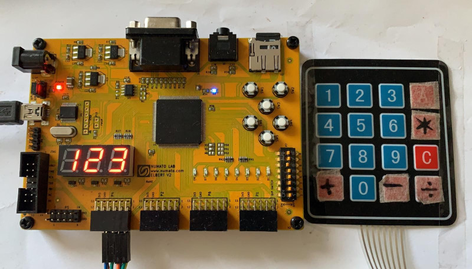
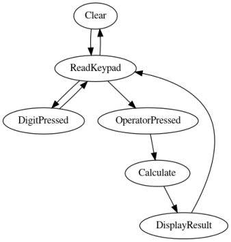

# A pocket calculator on FPGA

```
One potato two potatoes
Three potatoes, four!
Five potatoes, six potatoes
Seven potatoes, more!
```

As a follow up to one of my first FPGA projects [Adventures in hardware, part 3 - display and a calculator]() I wanted to implement a more useful calculator that behaves like the common pocket calculators - you enter a number, choose an operator, enter another number, press another operator or = and see the result. 

As my board only features three digit display, it will be slightly impractical and work on numbers from 0 to 999, but this time I wanted to operate it through a 4x4 keypad. 

I've been stuck on how to properly read the keypad for quite some time - this was planned to be titled `Hardware Adventures 5`, not `9`, after all.



_I had to relabel some keys with a surgical tape and a marker._

## The calculator architecture

The main calculator logic is implemented by a state machine with a few registers:

- `RESULT` holding the intermediate result
- `ARG` holding the currently 
- `DISPLAY` holding whatever needs to be displayed on the LCD screen
- `OPERATOR` holding the previously entered operator (`+-*/`)



_A simplified calculator state machine_

Notes on state transitions and register updates:
- When a digit gets pressed, `ARG <= ARG * 10 + digit`
- When an operator gets pressed, `OPERATOR` becomes one of `+-*/`
- on `Calculate` state: 
  + `RESULT <= RESULT OPERATOR ARG`
  + `OPERATOR <= OPERATOR_NEXT`
- `DISPLAY` register gets updated as required after states display_result and digit_pressed

### Required modules

To support the main state machine work we'll need several other components:

- **keypad poller** to debounce the keys
- **keypad encoder** to encode the keypad readout into a scancode
- **binary to bcd encoder** to convert the internal binary representation for display
- **seven segment encoder** to encode a BCD digit to segments
- **seven segment driver** to multiplex the three decimal digits over the shared wires
- **integer divider** to implement division

## Reading a keypad

In a 4x4 [matrix keypad](https://en.wikipedia.org/wiki/Keyboard_matrix_circuit) the key switches are connected by a **grid of wires arranged in 4 columns and 4 rows.** 
To determine what button is pressed, we need to scanning the crossings of the rows and columns by activating each column one at a time and read back the status of the rows. 
There are [several](https://appcodelabs.com/read-matrix-keypad-using-arduino) [articles](https://www.circuitstoday.com/interfacing-hex-keypad-to-arduino) that elaborate on this topic, if you're interested. 

Using this information we can write a [module](https://github.com/jborza/fpga_calculator/blob/master/keypad_encoder.v) that encodes a set of 4-bit row and column pins into a hexadecimal keycode. 

_Keypad layout_:
```
 1 2 3 A          
 4 5 6 B    
 7 8 9 C    
 * 0 # D	
```
> I decided to encode the * and # keys as 0xE and 0xF.


As I wanted to use this for a calculator, I've repurposed the C key for "Clear", then applied a surgical tape to label the `+-*/` keys.

> We also need to enable builtin [pull-down resistors](https://en.wikipedia.org/wiki/Pull-up_resistor) on the row pins in order to ensure a known state (logical zero) when a button is not pressed instead of a floating input.

## Entering multiple digits and displaying the number

Let's represent the number internally as binary and just convert to the display using a BCD encoder.

The reading of the keys will be handled by the calculator state machine within its `state_read_digit` and `state_digit_pressed` states.

We can limit reading numbers larger than 999 by using a simple condition in the `state_digit_pressed` state:

```verilog
if(reg_arg < 16'd100) 
begin
    reg_arg <= reg_arg * 10 + keypad_out;
end
```

To display the `DISPLAY` register we initially convert the 10-digit number to BCD, then [encode](https://github.com/jborza/fpga_calculator/blob/master/seven_seg_4bit.vhd) each digit (ones, tens, hundreds) into bits for the seven-segment display and finally [multiplex](https://github.com/jborza/fpga_calculator/blob/master/seven_seg_driver.vhd) them to the display.

A common algorithm for binary to BCD conversion is [Double dabble](https://en.wikipedia.org/wiki/Double_dabble) and I've adapted a Verilog single-clock implementation into a [10-bit version](https://github.com/jborza/fpga_calculator/blob/master/bin2bcd_10bit.vhd).


### Reading the keypad

Although I've found multiple descriptions for a single button debouncer, I didn't understand how to do it over multiple possible columns that we scan and I attempted to insert some kind of debounce circuit running at a lower frequency *after* the keypad decoder, hoping it would settle on a decoded number - somehow it didn't.

What finally helped was this [assignment](http://www.tkt.cs.tut.fi/kurssit/1426/S12/Ex/ex3/ex3.html) from a Tampere University that described the key poller and debouncer for the students. It describes an algorithm that probes the column successively, and for each column it waits for an input.

I could make the wait and hold times configurable, so it can be tuned to a specific keypad.

### Decoding the keypad

This is quite [straightforward Verilog](https://github.com/jborza/fpga_calculator/blob/master/keypad_encoder.v) implementation, with nested `case` statements, that produces a 4-bit hex scancode for every row/column combination.

## The calculator state machine

Now we just need to implement the [top module](https://github.com/jborza/fpga_calculator/blob/master/calculator_top.v) implementing the state machine mentioned earlier in the article and connecting all the other modules. 

### Adding, subtracting and multiplying

We can implement the basic operations using straightforward Verilog, which will get synthesized into adders and a hardware multiplier, therefore implementing the operations in a single clock cycle. 

```verilog
if(reg_operator == OP_PLUS) begin
    reg_result <= reg_result + reg_arg;
    state <= state_display_result;
end else if(reg_operator == OP_MINUS) begin
    reg_result <= reg_result - reg_arg;
    state <= state_display_result;
end else if(reg_operator == OP_MULTIPLY) begin
    reg_result <= reg_result * reg_arg;
    state <= state_display_result;
```

### Division

My FPGA tools [won't synthesize](https://stackoverflow.com/questions/40312206/algorithm-for-divison) the `/` operator, as a single-clock division by a variable number would be impractical to implement. I needed to implement a division module and wire it into the project. 

The simplest algorithm of all is [division by repeated subtraction](https://en.wikipedia.org/wiki/Division_algorithm#Division_by_repeated_subtraction):

```
while N = D do
  N := N - D
  Q := Q + 1
end
R := N
return (Q,R)
```

This translates to a straightforward [Verilog implementation](https://github.com/jborza/fpga_calculator/blob/master/integer_divider.v).

#### Integrating the divider module

As the division will run for a various number of clocks, we need to signal the parent module somehow that the division is completed:

We assign the divider inputs, signal it to `start` and transition into a waiting state:
```
end else begin //OP_DIVIDE
	divider_start <= 1'b1;
	numerator <= reg_result;
	denominator <= reg_arg;
	state <= state_dividing;
end
```

Then we continuously poll the `done` signal. If it's asserted, we move over to the common display result state.

```
state_dividing:
begin
    divider_start <= 1'b0;
    if(divider_done)
    begin
        reg_result <= quotient;
        state <= state_display_result;
    end
end
```

> In the real world one would probably use [Long division](https://en.wikipedia.org/wiki/Long_division#Binary_division) as it's completes in much less clock cycles than a simplistic division by subtraction.

### Stupid errors I made along the way

- I **forgot** again **to connect a top module input to a pin**. This will produce a cryptic message in Xilinx ISE and took some time to hunt down.

- An earlier iteration of the keypad decoder **couldn't distinguish zero from a non-key press**. I had to add `key_pressed` signal.
  
- Xilinx ISE doesn't tell you when you make a **typo in wire name**, when you wire a module to something that doesn't exist, for example `IO_P4_ROW` as `IO_DP4_ROW`.

- An earlier iteration of the keypad scanner used a clock that was driven by a counter. This is considered a very bad practice and [can result in glitches](https://www.intel.com/content/dam/www/programmable/us/en/pdfs/literature/hb/qts/qts_qii51006.pdf), results in creating new [clock domains](https://zipcpu.com/blog/2017/10/20/cdc.html) (which I don't really understand yet). The solution is to run the slow logic on the same (fast) clock as everything else, but use a slow enable signal or use a PLL circuitry for clock division. 


## The video

<video controls>
    <source src="hw9-calc-demo.mp4" type="video/mp4">
</video>

