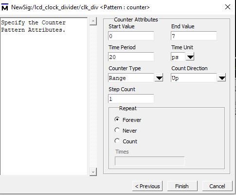
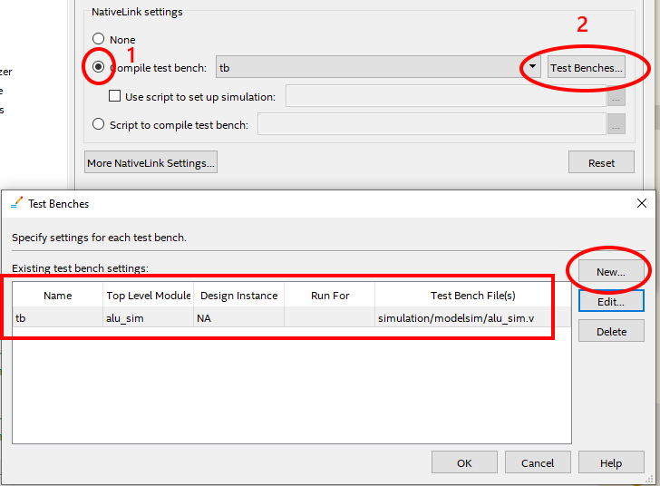
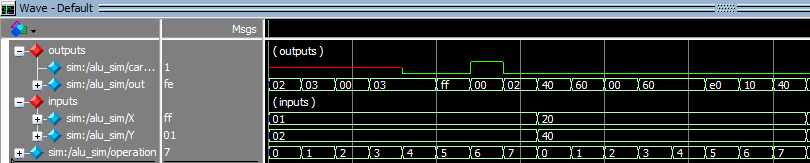

There seems to be a better way to run ModelSim than I originally described in the [LCD controller post](), where I was a bit lost with the tooling. 

### (Optional) - setting up ModelSim paths

If you didn't do this when the project was created, set path to `ModelSim-Altera` simulator in Tools->Options->General->EDA Tool Options to the location where your ModelSim is installed _(it was `C:\intelFPGA_lite\20.1\modelsim_ase\win32aloem\`) on my computer._ 

## Generating the testbench
There is actually a nice way to generate a Verilog testbench from within ModelSim.

Launch ModelSim with `Tools->Run Simulation Tool->RTL Simulation`.

Then go to the `work` library, find your design module (e.g. ALU.v), right click it and select `Create Wave`. This will open the unit in the wave editor.

Right click on each of your signal, select `Edit->Wave Editor->Create/Modify Waveform`.

Here you can specify the test data, for example a clock, constant value, list of values (repeater), a counter or random data.



Once you're happy with the wave, export it as Verilog testbench with `File->Export->Waveform...`.

_Sample of the generated code:_

```verilog
`timescale 1ps / 1ps
module alu_sim  ; 
 
  wire  carry_out   ; 
  wire  [7:0]  out   ; 
  reg  [7:0]  X   ; 
  reg  [2:0]  operation   ; 
  reg  [7:0]  Y   ; 
  ALU  DUT  ( 
      .carry_out (carry_out ) ,
      .out (out ) ,
      .X (X ) ,
      .operation (operation ) ,
      .Y (Y ) ); 

   reg [2 : 0] \VARoperation ;


// "Constant Pattern"
// Start Time = 0 ps, End Time = 1 ns, Period = 0 ps
  initial
  begin
	 X = 8'h1;
	 # 160 ;
	 X = 8'h20;
	 # 160;
	 X  = 8'h80;
	 # 160 ;
```


## Linking the testbench

Open `Assignments->Settings, EDA Tool Settings->Simulation` and in the NativeLink settings section select Compile test bench as follows:



Don't forget to add the test bench generated from the previous step with the `Add` button.

This will link the testbench file with the future runs of the simulator.

You can have multiple testbenches in the "Compile test bench" menu and select the unit you're working on / testing at the moment.

## Launching the simulation

Click `Tools->Run Simulation Tool->RTL Simulation`, ModelSim will launch and your test should generate the actual output wave.



## Getting outputs as X in the simulator

When I forgot to add a reset mechanism into a circuit, all of the outputs had the value of `X` instead of the expected values during the simulation.

It's because the initial value of the `reg` types is `X` (so not `0` or `1`). This can be resolved by either 
- initializing the value within the `initial` block - these synthesize well for FPGAs (but don't for ASIC / CPLD)
- using a `reset` signal, that seems to be the best practice