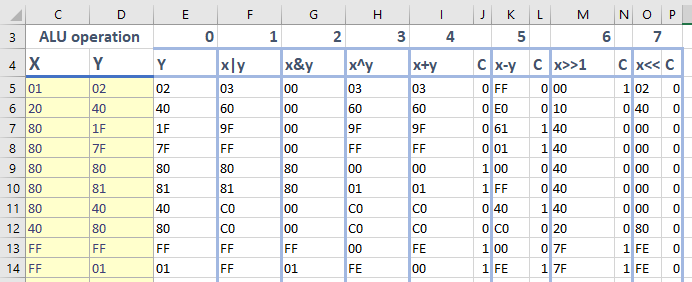

I got into FPGAs with the intent of building a retro-computer. A couple of popular hardware implementation targets are Gameboy, NES, RISC-V and CHIP-8. 
Last year I've done my practice round with [6502]() and [RISC-V](https://github.com/jborza/emuriscv/) emulators, both in C. 

CHIP-8 is a really nice virtual machine implemented on a number of computers since the 1970s, initially designed to make game development easier. 

After building a [CHIP-8 emulator]() a couple of days ago I thought I know a lot about the simple platform to actualy start implementing it in hardware, in Verilog and deploy to an FPGA board.

Other articles in the series:
- [CHIP-8 in FPGA #2 (CPU)]()
- [CHIP-8 in FPGA #3 (Video)]()

#### Why do it in hardware?

Because it is fun! CHIP-8 seems much simpler than other platforms, as it was _interpreted_ on 1970s hardware, so I think I could finish this project in a couple of afternoons.

### The target platform

I'm developing and testing against an Altera Cyclone IV development board, with two video outputs - 128x64 LCD display, VGA output. The board also features a buzzer for sound output. A 4x4 matrix keypad will serve as an input device.

## High-level design

I have some components already left over from my previous FPGA projects - such as a keypad controller and a memory-mapped display.

I plan to map the 64x32 pixels into the framebuffer/display RAM and let the existing pixel generator render it on an LCD/VGA external display, scaling the CHIP-8 pixels into larger squares.

It's probably too early to finalize the entire design, but I think it will consist of these parts:

- CPU
- RAM
- keypad controller
- display RAM
- display controller
- buzzer controller
- pseudorandom generator
- top module to wire them together

### CHIP-8 Virtual machine description:

CHIP-8 is a really simple platform, should be well within the capabilities of a cheap modern FPGA.

* 64x32 pixel monochrome display
* 4K of 8-bit RAM
* 16 8-bit "variable" registers V0-VF
* I 16-bit address register
* Stack of 16-bit addresses for call/return
* 16-bit PC - program counter
* 8-bit delay timer (decremented at 60 Hz) until it reaches 0
* 8-bit sound timer (decremented at 60 Hz), beeps when it reaches 0
* 16- key keypad that sends scan codes 0x1-0xF

### ROMs

ROMs will be "compiled" into the RAM initialization file for the time being - at least in the initial stages I'll use a Python tool to prepare the entire RAM image with the font and game ROM located at their respective addresses.

## CHIP-8 CPU roadmap

In my reference implementation in C the _fetch/decode/execute_ loop was handled by a single function that:
-  read the instruction bytes from the memory
-  used a [giant nested switch statement](https://github.com/jborza/emuchip8/blob/master/cpu.c#L81) to implement the individual opcodes

**Managing the complexity** is key in hardware design, so I'll try to break the giant switch into several modules that can be developed and tested independendly.

We can handle the _fetch_ part trivially, reaching into the RAM and reading two bytes in two clock cycles.

An **instruction decoder** can help with the _decode_ part of execution, trying to extract as much information from the opcode as possible.

We can offload the `8XYN` instruction an an **ALU** as the arithmetic `8XYN` instructions were dispatched to the 1802's ALU, so we can start by implementing a similar ALU.

I suspect I might also end up with a **blitter** module that will handle the `DXYN` drawing opcode.

### Execution and clock cycles

I think that many of the opcodes will be able to execute in a single clock cycle.

The most complex opcode is the `DXYN` one that draws a sprite at XY coordinate, as this will definitely take several clock cycles.

There are several other suspicious opcodes that could take more clock cycles - `00E0` clear screen, `FX33` BCD operation, `FX55` and `FX65` for register store / load.

## Part 1: ALU

CHIP-8 was originally designed for the [RCA 1802](https://en.wikipedia.org/wiki/RCA_1802) microprocessor. The arithmetic `8XYN` instructions were dispatched to the 1802's ALU, so we can start by implementing a similar ALU.

The C implementation in emuchip8 was procedural, so it doesn't translate well into circuits and it can be implemented in pure combinational logic.

Two of the nine CHIP-8 "ALU opcodes" are `vx-vy` and `vy-vx`. We can implement both in a single ALU subtract operation and swap the inputs.

### ALU opcodes

|op | result |
|-|-|
| 0| y |
| 1| x|y
| 2| x&y
| 3| x^y
| 4| x+y with carry
| 5| x-y with borrow 
| 6| x>>1
| 7 | x<<1

### ALU in Excel

To prepare test data I've used trusty Excel, where I encoded the ALU operations with mostly various edge case inputs I thought could cause trouble with wraparound.

_ALU operations with inputs, outputs and carry flag_

### ALU in Verilog

> I've made use of Verilog headers, which keep common constants. These headers get included into the ALU (and later in the instruction decoder) modules.

Then we use straightforward combinational logic to implement every ALU operation - [as seen in the code](https://github.com/jborza/fpga-chip8/blob/master/chip8_alu.v#L28).

### Validating with a test bench

I've generated a simple test bench that iterates over X,Y inputs and combines them with every operation (0-7).

## What's next?

Instruction decoder that will break down the CHIP-8 opcodes into ALU operations.