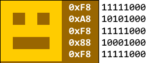
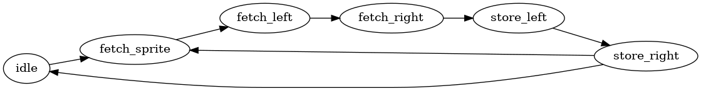
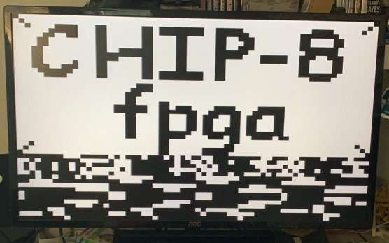
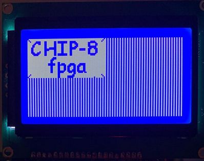

In the [last part]() I ended up with a partially working CPU with most of the single-clock instructions implemented. So far, all of the testing was done in simulator only, and it's about time to to get a visual output, so I implemented the **display** sprite operation next.

Other articles in the series:
- [CHIP-8 in FPGA #1 (ALU)]()
- [CHIP-8 in FPGA #2 (CPU)]()

## Display instruction: DXYN

The DXYN opcode is described in the [original manual](https://archive.org/details/bitsavers_rcacosmacCManual1978_6956559/page/n36/mode/2up) as: 

Show n-byte MI pattern at VX-VY coordinates. I unchanged. MI pattern is combined with existing display via EXCLUSIVE-OR function. VF = 01 if a 1 in M1 pattern matches 1 in existing display.

Wikipedia [says](https://en.wikipedia.org/wiki/CHIP-8) that the sprite has a width of 8 pixels and a height of N+1 pixels. Each row of 8 pixels is read as bit-coded starting from memory location I.

### The algorithm

The **framebuffer** at my CHIP-8 implementation is kept at the memory range `0x100 - 0x200`, spanning 8 bytes per row (64 bits / pixels), 32 rows, yielding 32 * 8 = **256 bytes** in total.

Because the X coordinate doesn't need to be aligned with 8, it's possible that the drawing operation will span two framebuffer bytes - we'll call them the _left_ and _right_ byte.



_A CHIP-8 sprite, stored as a byte sequence `0xF8, 0xA8, 0xF8, 0x88, 0xF8`_.

We need to read every row of the sprite, XOR them with the left and the right screen byte and then write these back.

### The CHIP-8 PPU

To keep my CHIP-8 design modular and testable, I wanted to spin the drawing logic off to a separate module. In the spirit of the [old gaming consoles](https://wiki.nesdev.com/w/index.php/PPU) I'd like to call this unit a PPU (Picture Processing Unit), as it accelerates sprite drawing by hardware. Hardware sprites were sometimes a part of [Video display controllers](https://en.wikipedia.org/wiki/Video_display_controller) that were used in the 1980s home computers.

I've created a state machine that iterates through the following steps, doing a loop for every row of the sprite.



The PPU's main interface consists of:

```verilog
input wire clk,
input wire reset,
input wire draw,            // aserted when we request a draw operation
input wire [11:0] address,  // the sprite address (CHIP-8 I register)
input wire [3:0] sprite_height, // the height of the sprite (N)
input wire [5:0] x,         // sprite X location
input wire [4:0] y,         // sprite Y location

output wire busy,           // asserted while PPU is busy working
output reg collision,       // collision output, goes to CHIP-8 VF register
```

The DXYN instruction itself makes the assert the `draw` signal, then the CPU waits until the `busy` signal goes low. It should also connect the address bus to the PPU for the duration of the sprite drawing.

> This design really took a while and a lot of re-reading on memories, state machines, Verilog and a lot and lot of simulation.

#### Timing

Because the data we read from the memory is delayed by 2 clock cycles, the sprite we fetch in the `fetch_sprite` state arrives at the `fetch_right`; the screen byte from the `fetch_left` state arrives at the `store_left` and so on.

> The delay is caused by using a registered outputs for the memory addresses, so on clock #1 we set the memory read address, on clock #2 the RAM registers the output and it arrives back in the PPU on clock #3.

I decided to store the sprite into a 16-bit register, shifted by the amount of the "overlap" with the second bit `(x % 8)`, so the left byte interacts with `sprite_row[15:8]` and the right byte with `sprite_row[7:0]`.

An example of the code - storing the left screen byte:

```verilog
STATE_WRITE_LEFT:
begin
    mem_write_data <= mem_read_data ^ sprite_row[15:8];
    mem_write_address <= address_left;
    mem_write_enable <= 1;
    collision <= collision | |(mem_read_data & sprite_row[15:8]);
    state <= STATE_WRITE_RIGHT;
end
```

#### Collisions

We know that a collision happens during the write if any of the bits are the same in the screen byte - so we can use the Verilog `|` unary operator that will peform the logical or operation on all bits of its operands and returns a single bit result: `|(mem_read_data & sprite_row[15:8]);`


### Checking that it works

I created a Verilog [testbench](https://github.com/jborza/fpga-chip8/blob/master/simulation/modelsim/ppu_sim.v) that connects the PPU to a memory that contains the sprites of a particular ROM, 

```verilog
// set up drawing parameters as if DXYN was encountered
I = sprite_addr;
vx = draw_x;
vy = draw_y;
n = height;
ppu_draw = 1;
// 
# 20;
ppu_draw = 0;
// wait until the drawing finishes
#10 wait (!ppu_busy)

//check 
assert_equal(ppu_collision, 0);
assert_equal(ram.mem['h141], 'h0f);
assert_equal(ram.mem['h142], 'hf0);
```

I assert every few bits in the PPU testbench, but for a quick win, we can also dump the memory contents with a following command:

```tcl
mem save -format binary -noaddress -startaddress 256 -endaddress 511 -wordsperline 1 -outfile ram-framebuffer-dump.bin ram
```

that produces a RAM dump in a following format:

```
00000000
00001111
11110111
11111100
01111100
00000001
11110000
00000000
```

We can then use a [Python script](https://github.com/jborza/fpga-chip8/blob/master/tools/draw-framebuffer-from-dump.py) to convert this into a monochrome PNG bitmap.


_a 64x32 output of a logo drawing ROM_

## VGA driver

As the CHIP-8 specifications reserves the address `0x000 - 0x1FF` for the interpreter use, we can designate the `0x100 - 0x1FF` region as the internal framebuffer. The VGA driver is split into two modules:

**Horizontal/vertical sync generator** (hvsync) and **pixel generator**.

To make my life a bit simpler, the _hvsync generator_, which normally generates VGA pixel coordinates (640x480) also generates CHIP-8 pixel coordinates (64x32) along the way, so we can know exactly where in the RAM the pixel values are located.

The pixel generator reads the byte of the memory on every "pixel tick", looks at the bit that corresponds to the CHIP-8 x/y coordinates and outputs black or white color on the VGA interface.

> Note: It seems inefficient to read the memory for every pixel as we really need a new byte every 800 pixels (as we scale both `x` and `y` dimension by a factor of 10), but this module has nothing better to do anyway. We could add a shift register to read only once every 8th pixel clock cycle.

It's not very integrated at the current stage, as I tested it with just the ROM and the CPU unplugged to avoid the CPU and the VGA module fighting for access of the same memory - I'd like to solve this in the next part. 

## LCD driver

I did a reuse my previous 128x64 LCD driver as well. As it expects its own 128x64 bit framebuffer, I implemented a memory copy module that copies main RAM region `0x100 - 0x1ff` to the first 64x32 bits of the LCD framebufffer (without pixel doubling, it was just a quick hack).

### RAM converter

To get **something** into the framebuffer in the current stage of the project  I dumped the CHIP-8 RAM contents from my [CHIP-8 C emulator]()) and converted them to the RAM `.txt` initialization format using a following Python script that reads each byte and outputs it as 8 bits on every line:

```python
import sys
with open(sys.argv[1],"rb") as f:
    bytes_read = f.read()
for byte in bytes_read:
    print(f'{byte:08b}')
```

A sample framebuffer contents displayed on a big 32" VGA display. The noise following the 64x32 "pixels" is the next area of the memory - instructions of the program present at the address `0x200` following the framebuffer.



Finally a 64x32 area of a 128x64 LCD screen (I was lazy, so I just implemented it without pixel doubling).



## What's next

The CPU still needs some love as not all operations are implemented yet. To get it all working together we need some kind of bus to transfer data between CPU, memory and PPU. The VGA or LCD renderers are not scheduled yet, so the would fight with the CPU for the bus - I think the most reasonable solution would be to let the CPU run during the VGA vertical synchronization window.

Then we still need some user input (from a keypad), a sound output to a buzzer, wire it all together and figure out a nicer way to load ROMs.