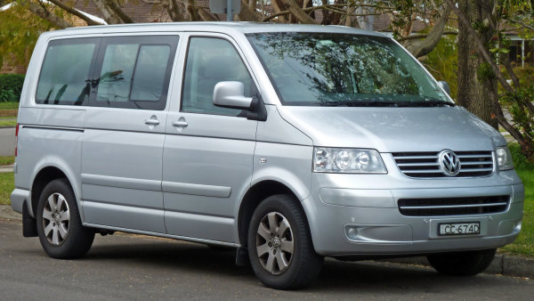
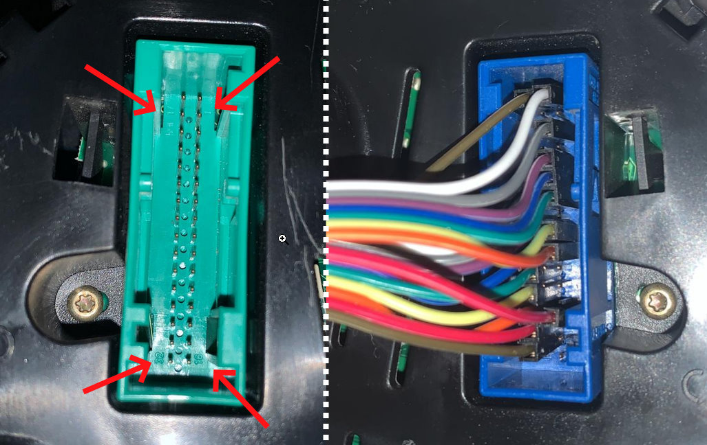
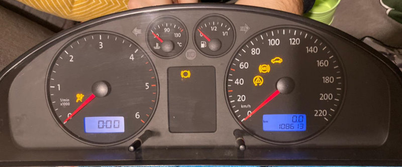
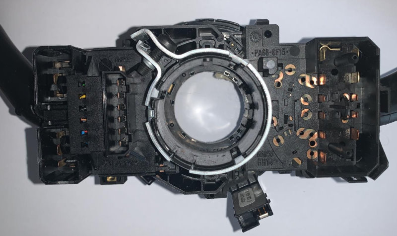
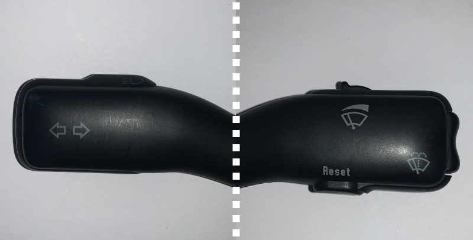

## Car accessories as game controllers?

I got inspired by the [CAN BUS Gaming Simulator](https://hackaday.io/project/6288-can-bus-gaming-simulator) post on hackaday, where Leon Bataille connected a VW Polo dashboard and switches to Euro Truck Simulator 2.

I'd like to do something similar, but with with parts from a slightly different vehicle. In this article I'll describe my initial findings - how the things are wired together.

## Instrument cluster as output

Volkswagen group parts tend to be cheap around here, so I scored an instrument cluster from a VW Transporter T5 for 10 €, part number `7H0 920 850 R`.

_The donor vehicle looked probably like this._

The cluster has two 32-pin connectors that happen to be compatible pitch-wise with the standard breadbord jumper wires. I suspected that it won't be necessary to connect all 64 pins

I've found a pinout on a [German forum](https://avdi-forum.de/avdi_aktuell/index.php/Thread/685-Pinbelegung-Tacho-VW-Transporter-T5-bis-2009/) and converted it into tabular form, as I wanted to do the wiring next.

_Green connector with the pin numbering, blue connector after the wiring_



I powered both 12V wires from an adapter and the cluster lit up - so at least that works :)

## Steering column switches as input

To feed the simulator with external input I'd like to use a real steering column switches. 

Again, to keep the project costs I've bought the steering column switches from Škoda Fabia for another 10 €, part numbers `8LO 953 513 G` and `4BO 983 503 G` for the left and right stalks. These parts are shared between Volkswagen, Audi, Seat and Škoda, so the pinout should also be well documented online. 

I suspect this consists of passive components only - simple switches that should close a circuit / emit a signal whenever a button is pressed or a stalk is moved into a specific position. In that case we won't need 12 volts, but whatever our microcontroller uses for the digital inputs. 

The connectors are not the standard "needle" pins but some kind of flat pins, most probaly [FASTON terminals](https://en.wikipedia.org/wiki/FASTON_terminal). 

>I'll buy some and update this article when they arrive.

As the left and right stalk are separate parts, they would be wired separately as well, so it makes sense to analyze them individually.

_The left stalk with turn indicators and beam switch, the right stalk with wiper controls and board computer buttons_

### Turn indicator stalk

The left stalk `8LO 953 513 G` controls the turn indicators and the headlights. It has 11 pins with labels such as `56`, `56b`, `PL`, `PR` and so on.

It turns out these are standardized in [DIN 72552](https://en.wikipedia.org/wiki/DIN_72552), which specifies the codes for many contacts in the automobiles.

The table with the signal listing:



To actually decode which position the switches are in, we need to follow the logic of the wiring, as described in [this blog post](https://golf2lin.wordpress.com/node-design/steering-column/). 

#### High/low beam and flash

| Position | State | Comment
|-|-|-|
| Low beam | `56 -> 56b`
| High beam | `56 -> 56a`
| Flash | `30 -> 56a` | Flashing works even with lights switched off

> Note that the terminal `56` will be powered when the lights are on.

This means that we can need to connect the pins `56` and `30` as digital output and `56a`/`56b` as digital input in our microcontroller.

#### Turn indicator

| Position | State | Comment
|-|-|-|
| Left signal | `P -> PL`
| Right signal | `P -> PR`

#### Summary of signals we need to connect

| Inputs | Outputs |
|-|-|
| `PL`| `30`
| `PR` | `56`
| `56a` | `P`
| `56b`

It seems that we don't need to connect the pin `49a`.

### Wiper stalk

The right stalk `4BO 983 503 G` controls the wiper and the board computer. 

It has three connectors in total:
-  straight long connector with pins labeled `1` to `6`
-  L shaped connector with pins `HW`, `53b`, `INT`, `53a`
-  L shaped connector with pins `53`, `31`, `53e`, `53c`.

Using DIN 72552 as a reference shows that the `53x` are related to the window wiper/washer, `31` is ground.

`INT` should be related to the intermittent wiper mode. `HW` should be Front window cleaner.

#### Wiper connectors

Stalk positions:

| Position | Connection |
|-|-|
Wiper off | `53a -> none` 
Intermittent | `53a -> INT` 
Normal | `53a -> 53`
Fast | `53a -> 53b`
Pulled | `53a -> 53c`
Down | `53a -> 53`

#### Board computer connectors

I guess the long connector is be related to the board computer buttons (up, down, reset).

According to a [workshop manual](https://workshop-manuals.com/audi/a2/vehicle_electrics/electrical_system/lights_lamps_switches_outside/steering_column_switch/connection_assignment_at_steering_column_switch/) they should be:

| Contact | Description                         |
|---------|-------------------------------------|
| 1       | Rocker up                           |
| 2       | Rocker down                         |
| 3       | Ground (A)                             |
| 4       | Reset                               |
| 5       | Relay for wash/wipe interval system |
| 6       | Ground (B)                          |

> Probing the rocker up/down and reset buttons with the multimeter buzzer worked - I got a beep on the correct pin with the buttons pushed.

It also includes a 4-position rocker that controls the intermittent wiper speed. It acts as a potentiometer between the pins `5` and `6`, with the values of approximately 1.95 kΩ, 4.53 kΩ, 7.77 kΩ and 15.5 kΩ. 

So more connectors required are:

| Inputs | Outputs |
|-|-| 
| `1` | `3` 
| `2`
| `4`

#### Summary of the required connectors of the steering column switches

Overall, there are 17 signals to/from the switches. That's still enough to handle with an Arduino Nano, which features analog and digital inputs.

| Digital output | Digital input | Analog input 
|-|-|-|
| `3` | `1` | `5`
| `6` | `2`
| `53a` | `4`
| `30` | `INT`
| `56` | `53`
| `P` | `53b`
| | `53c`
| | `PL`
| | `PR`
| | `56a`
| | `56b` 

#### Getting the inputs to a computer

Reading the switches and buttons should be easy with an Arduino. However, to make the inputs usable in a game, I'll probably need a board that can act as USB HID device (keyboard or a gamepad), so I'll probably look into ATmega32u4 board (Arduino Micro). 

Another option is to send the events to the PC over a serial port and write a utility to convert them into key press/release to use in a game/simulator.

## What's next

There are several follow-up activities: 
- Connecting an Arduino CAN bus shield to the CAN bus pins on the instrument cluster
- Lighting individual warning lamps on the instrument cluster 
- Successfully processing the signals from the turn indicators with Arduino and communicating that back to the PC
- Making it all work with a driving simulator :)
