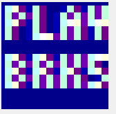
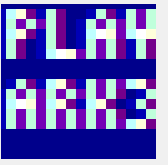

## A collection of minigames under 4 KB

As a kid, I had a cheap **8 in 1 Brick Game** handheld console, which had LCD display with large dots, 4 directional buttons and a speaker. Along with a couple of Tetris variations it had games like car racing, brick shooting, brick building and a snake game.

I also like game development and fun limitations. As an exercise, I wanted to write a minimalistic game that would **run in the** Windows **taskbar** (system tray). This way you can have an inconspicuous gaming session while anyone who looks at your screen could not suspect anything.

In the spirit of the cheap handheld consoles there should definitely more than one game, so I've built four: Snake, Brick Shooter, Cars and Breakout. 

This is how the game looks when running in the task bar:


As it's really tiny, I magnified it by a factor of 2:


The individual games scaled by 10x:

   

There's also a little menu screen that allows the player to pick a game and a difficulty.

### Tech stack

All we really need to to is to render the game canvas to a tray icon, handle input, process the game logic and produce some sound.

C# with the .NET Framework seemed like a good tool for the job, leveraging the **GDI+** (System.Drawing) graphics library for rendering and the **Windows Forms API** to place and redraw the tray icon. 

The icon in the task bar has a size of **16x16 pixels**, that's how large our canvas needs to be, so we're literally pushed into the pixel art direction. This also means we can afford to draw every frame from scratch as modern computers are fast. 

Arrow keys work as controls, space bar starts or restarts a game. Because we don't have meaningful way to give focus to a tray icon, **we hijack the global keyboard events** using the [RegisterHotKey](https://docs.microsoft.com/en-us/windows/win32/api/winuser/nf-winuser-registerhotkey) API.

**Sound effects** (beeps) are produced with the `Console.Beep()` API.

The game loop is handled by a `Timer` that ticks at a fixed rate, and the **difficulty** setting adjusts how many **ticks to skip**.

### Why Code Golfing?

[Code golfing](https://en.wikipedia.org/wiki/Code_golf) is a time-honored tradition where programmers try to achieve the shortest source code possible while still retaining the functionality. 

I do that sometimes for fun and golfing a game seemed like a worthy challenge. While C# isn't the traditional code golf language of choice due to its verbosity, I already had a working game and thought it could fit under 4 kilobytes of source code.

The original _(already slightly unreadable)_ version had 9586 bytes of code. 
**The final golfed size is 3727 bytes.**
Binary size (x64, release) is 9728 bytes.

> Removing all whitespace could save around 300 more bytes, as there are 165 lines with 2-byte CRLF line endings.

If you're interested in code golf, there's a vibrant community at [Code Golf Stack Exchange](https://codegolf.stackexchange.com/). There's also a [JS1K](https://js1k.com/) Javascript code golfing competition with the aim of creating something cool with a max size of 1 KB.

### An example

if (mode == BRK)
{
//draw player
g.DrawLine(Pens.Magenta, X, 15, X + 5, 15);
//draw blocks
for (int y = 0; y < H; y++)
    for (int x = 0; x < W; x++)
        if (M[y][x] > 0)
            FR(B.Cyan, x, y);
//draw bullets
g.DrawLine(BP, X + 2, 15, X + 2, 0);
}
```
_The original version, 231 characters without comments_

```csharp
if(m==0){
J(Pens.Magenta,X,Z,X+5,Z);
for(y=0;y<H;y++)
for(x=0;x<W;x++)
if(b[y][x]>0)
FR(B.Cyan,x,y);
J(BP,X+2,Z,X+2,0);
}
```

_The golfed version, 128 characters_

## Code Golfing tips and tricks

Table of contents:
- [Shorter identifiers](#shorter-identifiers)
- [Skipping whitespace](#skipping-whitespace)
- [Code / identifier reuse](#code--identifier-reuse)
- [Code (re)organizing](#code-reorganizing)
- [var vs type names](#var-vs-type-names)
 (#dont-use-var-when-using-array-initializer)
- [Conditionals](#conditionals)
- [Miscellaneous aka cheap tricks](#miscellaneous-aka-cheap-tricks)

Here's a bag of tricks:

> DISCLAIMER: Please don't use the following techniques in production code, it will make your colleagues unhappy.

## Shorter identifiers

### Single character identifiers are your friends

There are 53 valid single character identifiers:
	
```csharp
ABCDEFGHIJKLMNOPQRSTVWXYZ
abcdefghijklmnopqrstvwxyz
_
```

**Characters saved:** varies
> Tip #1: underscore is your friend

> Tip #2: The readers will likely appreciate you mixing l and I

### Type aliases:

I created aliases for some commonly used types, e.g.

```csharp   
	Brushes.Black
	Brushes.Red
	Brushes.Red
	Brushes.White

	using B=System.Drawing.Brushes;
	B.Black
	B.Red
	B.Red
	B.White
```

**Characters saved:** varies, depending on the length of the fully qualified type

Other example: 

```csharp
	using P=System.Drawing.Point;
```

### using static for Math

The [using static](https://docs.microsoft.com/en-us/dotnet/csharp/language-reference/keywords/using-static) directive allowed savings for multiple repetitions of static Math methods such as Min, Max.

Example:

```csharp
	spd=Max(1,Min(spd+dx,9));
	spd=Math.Max(1,Math.Min(spd+dx,9))
```

**Characters saved:** some, starting when Math methods used more than 5 times. Compare the length of the following:

```
using static System.Math;
Math.Math.Math.Math.Math.
```

### Interface or DllImport method argument names don't matter

```csharp
[DllImport("user32.dll")]
static extern bool RegisterHotKey(IntPtr h,int i,int f,int v);

vs

[DllImport("user32.dll")]
static extern bool RegisterHotKey(IntPtr hWnd, int id, int fsModifiers, int vk);
```

**Characters saved**: significant for long parameters

## Skipping whitespace

### Variables of the same type can be declared on one line

```csharp
int L=-1,R=1,U=3,D=4,_=5,W=16,H=14;

vs

int L=-1;int R=1;int U=3;int D=4;int _=5;int W=16;int H=14;
```

**Characters saved:** 4 for every sequence of `int` and a whitespace

### Skip whitespace in class declaration

	class A:ApplicationContext,IMessageFilter{

### Skip whitespace in some variable declarations

 C# doesn't require a whitespace between a type and the identifier when they are already separated by square or angled brackets - arrays or generics.

```
	int[][]M;
	List<P>snake;
```
> Note: Doesn't work in regular cases, such as `int M;`


### Skip whitespace after parentheses

```csharp
	if(h.X>W||h.X<0||h.Y<0||h.Y>W)mode=OVR;
```

**Characters saved:** 1

> Note: It may make more sense to squash all whitespace with a separate pass instead of doing this by hand.

## Code / identifier reuse

### Reuse variables for different purposes 

If you have a nice `List<Point>` used for the body of the snake, why not reuse it as a container for blocks in the block-breaking part of the game?

Also, I reused `f` as the food position in the snake game and the ball position in the breakout game.

### Using a global variable for a loop variable

You could define `int i,j,k` on the class level and then skip declaring loop variables, such as `int i` in every `for` loop.

```csharp
	int i;
	for(i=0;i<9;i++)
	for(i=0;i<9;i++)
	for(i=0;i<9;i++)

vs:

	for(int i=0;i<9;i++)
	for(int i=0;i<9;i++)
	for(int i=0;i<9;i++)
```

**Characters saved:** Almost always

> Beware: Be careful of overwriting the loop variable in nested loops or loops that span over method calls.

### Shadowing global variables with locals when necessary

Useful when you're running out of 1-character identifiers - but less likely as there's a lot of them.

## Code (re)organizing

### Extracting methods

Pays off when the same bit of functionality is repeated and the method 

```csharp
Action<int,Keys>E=(k,K)=>RegisterHotKey(IntPtr.Zero,k,0,(int)K);
E(L,Keys.Left);
E(R,Keys.Right);

vs

RegisterHotKey(IntPtr.Zero,L,0,(int)Keys.Left);
RegisterHotKey(IntPtr.Zero,k,0,(int)Keys.Right);
```

or 
```csharp
filling out a 1 px rectangle:
Action<Brush,int,int> F=(b,x,y)=>g.FillRectangle(b,x,y,1,1);
F(Brushes.Black,x,y)
F(Brushes.Red,p.x,p.y)

vs 

g.FillRectangle(Brushes.Black,x,y,1,1)
g.FillRectangle(Brushes.Red,x,y,1,1)
```

### Inlining methods 

Inverse strategy to extracting - it makes sense to inline the method body if it only gets called once.

```csharp
void L(){code;code;code;}
vs
code;code;code;
```

**Character savings:** 10 for void parameterless methods

### Extract numerical constants
	
In some cases, extracting a constant that is used repeatedly saves space. 

If you are going to use -1 in your code 6 times, that's 12 characters
However, if you add one more int declaration as `L=-1,`, then using `L` 6 times requires 10 characters + 5 for declaration

Compare:

```csharp 
-1-1-1-1-1-1
L=-1,LLLLLL

and 

123123123
N=123,NN
```

**Characters saved:**  Starts to pay off at
- 6 repetitions of two-digit constant
- 3 repetitions of three-digit constant

> Tip: You can use Visual Studio's Find All References commands for constants, it calculates number of occurrences

### Don't declare constants for a single digit int

It always results in a net loss of characters, readability be damned. Refactoring or changing the size of something is a pain, though.

### Avoid declaring variables at all

If you only need to name an expression and later use it once, then it does not need a name and can be inlined.

## var vs type names

### var instead of full type name for locals

In some cases `var` is shorter to type than the full type name, for example:

```csharp
var I=new int[W];

vs

int[] I=new int[W];
```

**Characters saved:** Length of the type name - 3 

### Don't use var when using array initializer

Example:

```
	string[] games={"BRK","SNK","CRS","ARK"};
	var games=new string[]{"BRK,"SNK","CRS","ARK"}
```

## Conditionals

### Conditionals - if vs switch

Sometimes a sequence of `if` statements can be shorter than a corresponding switch statement, as we have to include `break` statements in C#:

```csharp
if(k==U){dy=-1;dx=0;}
if(k==D){dy=1;dx=0;}
if(k==L){dx=-1;dy=0;}
if(k==R){dx=1;dy=0;}

vs

switch(k){
case U:dy=-1;dx=0;break;
case D:dy=1;dx=0;break;
case L:dy=-1;dx=0;break;
case R:dy=1;dx=0;break;
}
```

### Ternary operator vs `if` in an assignment

```csharp
	N=y<6?MkR():new int[W];
	if(y<6)N=MkR();else N=new int[W];

	x=b?1:2;
	if(b)x=1;else x=2;
```

**Characters saved:** 10, depending on length of the target variable name as it is spelled out only once in a ternary.

### Use object initializers - you save 1 character per property initialized

```csharp
Q=new Timer(){Interval=W};

vs

Q=new Timer();Q.Interval=W;
```

**Characters saved:** 1 per every property initialized

## Miscellaneous aka cheap tricks

### Casting an int constant to the enum

This helps with almost all enum values with long names. For most enums, if the Enum value is longer than 4 characters, go for it.

```csharp
g.SmoothingMode=(System.Drawing.Drawing2D.SmoothingMode)4;
F=new Font(c.Families[0],5,(GraphicsUnit)5);

vs

g.SmoothingMode=System.Drawing.Drawing2D.SmoothingMode.AntiAlias;
F=new Font(c.Families[0],5,GraphicsUnit.Pixel);
```

**Characters saved:** Length of the enum value name - 2 - (digits of the int value)

> Note: It also worked with IntPtr: IntPtr.Zero vs (IntPtr)0

### Use operators to your advantage

For example, adding `Size` to a point is easier with the `+` operator of `Point` as it's already built into the framework:

```csharp
	var dst=P.Add(snake[0],new Size(dx,dy));
	var dst=snake[0]+new Size(dx,dy);
```

### Drawing 1 rectangle vs 2 lines

Example: Vertical walls in the brick-breaking mode:
	
```csharp
	g.DrawRectangle(Pens.Blue,0.5f,-1,15,18);
	vs
	g.DrawLine(Pens.Blue,0,0,0,W);
	g.DrawLine(Pens.Blue,15,0,15,W);
```

Characters saved: 22

> Note: If you want to align GDI+ DrawRectangle with DrawLine, you need to shift it by 0.5f pixels

### Pick colors with shorter names

`Brushes.Red` is shorter than `Brushes.Green`.

## Shortcuts taken

There are more than a few shortcuts or hacks that should be avoided in a more serious attempt at a similar game.

First, there are no win conditions - you cannot win this game.

I didn't clean up the resources properly as they will get disposed of eventually when you close the application. 
The application is also probably leaking resources like mad as a new `Icon` is generated for every bitmap for every frame.

The code never unregisters the hotkeys after registering them at the game start, so you need to terminate it in order to use the arrow keys or space bar for anything other than the game.

I did use an external [CG pixel 4x5](https://fontstruct.com/fontstructions/show/1404171/cg-pixel-4x5) font file so there is some legible text at the tiny 16x16 resolution.

Right clicking the game icon initially opened a context menu with a single Exit option - but we don't *really* need that, the player can kill the executable from the Task Manager.

## The code

Hosted with <3 on GitHub: [https://github.com/jborza/traygame](https://github.com/jborza/traygame)

Golfed source: https://github.com/jborza/traygame/blob/master/Program.cs

Ungolfed version: https://github.com/jborza/traygame/blob/master/Program_Ungolfed.cs