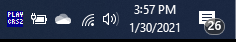
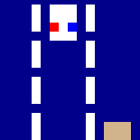

## A collection of minigames under 4 KB

As a kid, I had a cheap **8 in 1 Brick Game** handheld console, which had LCD display with large dots, 4 directional buttons and a speaker. Along with a couple of Tetris variations it had games like car racing, brick shooting, brick building and a snake game.

I also like game development and fun limitations. As an exercise, I wanted to write a minimalistic game that would **run in the** Windows **taskbar** (system tray). This way you can have an inconspicuous gaming session while anyone who looks at your screen could not suspect anything.

In the spirit of the cheap handheld consoles there should definitely more than one game, so I've built four: Snake, Brick Shooter, Cars and Breakout. 

This is how the game looks when running in the task bar:



As it's really tiny, I magnified it by a factor of 2:


The individual games scaled by 10x:

   

There's also a little menu screen that allows the player to pick a game and a difficulty.

### Tech stack

All we really need to to is to render the game canvas to a tray icon, handle input, process the game logic and produce some sound.

C# with the .NET Framework seemed like a good tool for the job, leveraging the **GDI+** (System.Drawing) graphics library for rendering and the **Windows Forms API** to place and redraw the tray icon. 

The icon in the task bar has a size of **16x16 pixels**, that's how large our canvas needs to be, so we're literally pushed into the pixel art direction. This also means we can afford to draw every frame from scratch as modern computers are fast. 

Arrow keys work as controls, space bar starts or restarts a game. Because we don't have meaningful way to give focus to a tray icon, **we hijack the global keyboard events** using the [RegisterHotKey](https://docs.microsoft.com/en-us/windows/win32/api/winuser/nf-winuser-registerhotkey) API.

**Sound effects** (beeps) are produced with the `Console.Beep()` API.

The game loop is handled by a `Timer` that ticks at a fixed rate, and the **difficulty** setting adjusts how many **ticks to skip**.

### Why Code Golfing?

[Code golfing](https://en.wikipedia.org/wiki/Code_golf) is a time-honored tradition where programmers try to achieve the shortest source code possible while still retaining the functionality. 

I do that sometimes for fun and golfing a game seemed like a worthy challenge. While C# isn't the traditional code golf language of choice due to its verbosity, I already had a working game and thought it could fit under 4 kilobytes of source code.

The original _(already slightly unreadable)_ version had 9586 bytes of code. 
**The final golfed size is 3727 bytes.**
Binary size (x64, release) is 9728 bytes.

> Removing all whitespace could save around 300 more bytes, as there are 165 lines with 2-byte CRLF line endings.

If you're interested in code golf, there's a vibrant community at [Code Golf Stack Exchange](https://codegolf.stackexchange.com/). There's also a [JS1K](https://js1k.com/) Javascript code golfing competition with the aim of creating something cool with a max size of 1 KB.

### An example

_The original version, 231 characters without comments_:

```csharp
if (mode == BRK)
{
//draw player
g.DrawLine(Pens.Magenta, X, 15, X + 5, 15);
//draw blocks
for (int y = 0; y < H; y++)
    for (int x = 0; x < W; x++)
        if (M[y][x] > 0)
            FR(B.Cyan, x, y);
//draw bullets
g.DrawLine(BP, X + 2, 15, X + 2, 0);
}
```

_The golfed version, 128 characters_
```csharp
if(m==0){
J(Pens.Magenta,X,Z,X+5,Z);
for(y=0;y<H;y++)
for(x=0;x<W;x++)
if(b[y][x]>0)
FR(B.Cyan,x,y);
J(BP,X+2,Z,X+2,0);
}
```

## Code golfing tips and tricks

⚠️ I've moved this section to a [separate article](), which goes over the individual techniques in details.

## Shortcuts taken

There are more than a few shortcuts or hacks that should be avoided in a more serious attempt at a similar game.

First, there are no win conditions - you cannot win this game.

I didn't clean up the resources properly as they will get disposed of eventually when you close the application. 
The application is also probably leaking resources like mad as a new `Icon` is generated for every bitmap for every frame.

The code never unregisters the hotkeys after registering them at the game start, so you need to terminate it in order to use the arrow keys or space bar for anything other than the game.

I did use an external [CG pixel 4x5](https://fontstruct.com/fontstructions/show/1404171/cg-pixel-4x5) font file so there is some legible text at the tiny 16x16 resolution.

Right clicking the game icon initially opened a context menu with a single Exit option - but we don't *really* need that, the player can kill the executable from the Task Manager.

## The code

Hosted with <3 on GitHub: [https://github.com/jborza/traygame](https://github.com/jborza/traygame)

Golfed source: https://github.com/jborza/traygame/blob/master/Program.cs

Ungolfed version: https://github.com/jborza/traygame/blob/master/Program_Ungolfed.cs