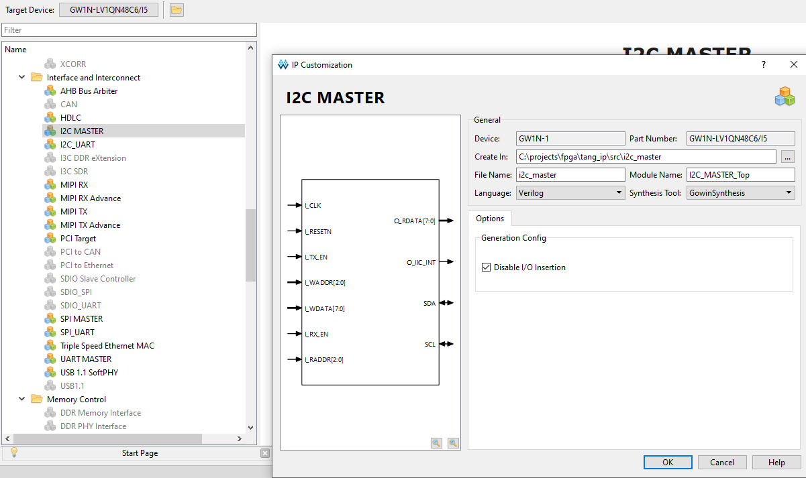

## Sipeed Tang Nano FPGA development board

I like FPGA development boards and I'm excited that there are products that exist outside of the Xilinx / Intel duopoly. This branch of the Chinese semiconductor industry is still developing and I was curious enough to order the [Sipeed Tang Nano](https://www.seeedstudio.com/Sipeed-Tang-Nano-FPGA-board-powered-by-GW1N-1-FPGA-p-4304.html) development board.

This article describes my experience after experimenting with the board and the development tools from the vendor.

It comes in a small and breadboard-friendly package measuring 58x21 mm, the shape reminds me of Arduino Nano.


_Sipeed Tang Nano board_

The onboard FPGA chip is GOWIN **GW1N-LV1QN48C6/I5**, based on 55 nm procss, equipped with 1152 LUT4 logic resources, 1 PLL and 4 Block RAM (72 kbit total). The onboard crystal ticks at 24 MHz. USB-C connector is a welcome sight, it serves both as a power and programming interface. I counted 29 pins available to the user, which should be fine for little projects.

The development board also features a 40-pin connector for the [800x480 LCD display](https://www.seeedstudio.com/5-Inch-Display-for-Sipeed-Tang-Nanno-p-4301.html), the display itself is available separately for around $25 including shipping. I didn't get the display to save some money as I have plenty of displays around.

As for the There's also 64 Mbit PSRAM, I'm not really sure how to use it as I could not find any documentation on it. The lack of any hardware multiplier could pose a problem for some projects. 

1152 LUTs offers definitely less capacity compared to the smallest Xilinx / Intel chips, which provide around 6000 logic cells. However, it should be sufficient for small glue logic / adapter kind of projects. 

### The documentation

There's an [official website](https://tangnano.sipeed.com/en/) that offers a walkthrough with two sample projects and is curiously missing the last one dealing with the onboard PSRAM. I wasn't much impressed by the official docs as they skipped a few steps that could confuse a beginner (me). There's a nice [pinout](https://tangnano.sipeed.comtang_nano_pinout_v1.0.0_w5676_h4000_large.png) schematic available.

I was much happier with a series of articles by Dave Vanden Bout at [xess.com](https://xess.com/tang_nano_user), which contained a nice [getting started](https://xess.com/tang_nano_user/docs/_site/getting_started/) tutorial and a very valuable [pinout spreadsheet](https://xess.com/tang_nano_user/docs/_site/nano_pinout/).

## The tools 

The first project I built was the traditional 'blinky' - blinking the built-in RGB LED in different colors.


The tool of choice is 

The tool supports both Verilog and VHDL, it includes all basic tools such as schematic viewer, IP core generator and a floor planner.

There are also several IP cores available for things such as `I2C`, `MIPI`, `SPI` and curiously enough also `USB SoftPHY` core.


_IP core generator with schematic and customization dialog_


_Schematic viewer - we can view individual modules, highlight nets and jump to source from individual primitives_

There's also Gowin Analyzer Oscilloscope that allows you to capture signals based on a user-defined trigger, store them in the internal memory and stream the results to the PC, similar to SignalTap logic analyzer from Intel.


### Open-source?

It would have been cool if the Chinese vendors embraced the open source toolchain such as [Symbiflow](https://symbiflow.readthedocs.io/en/latest/toolchain-desc.html) / yosys / nextpnr. There's a [project Apicula](https://github.com/YosysHQ/apicula) that aims to document the GOWIN bitstream and make it usable with the open source tools.

### A slightly more advanced project

I built a metronome by wiring a buzzer to the board. You can control the tempo with two built-in pushbuttons. I wanted to make the tempo slower or faster with two buttons and also change the LED pattern on each beat. 

Because I only had an active 3 kHz buzzer on hand, I produced a tick by pulsing it for 2.5 ms. A [debouncer](https://github.com/jborza/tang_metronome/blob/master/src/button_debouncer.v) and [synchronizer](https://github.com/jborza/tang_metronome/blob/master/src/button_synchronizer.v) module instance was required for each button. A [speed generator](https://github.com/jborza/tang_metronome/blob/master/src/speed_generator.v) module implemented a look up table that converted a "speed" selection to a number of clock cycles. The [top module](https://github.com/jborza/tang_metronome/blob/master/src/top.v) contained wiring between the modules and the ticking logic itself.

Verilog sources can be found on [GitHub](https://github.com/jborza/tang_metronome/tree/master/src).

> I'm aware that this kind of project is easier to implement on a microcontroller, but this was also fun.

This is how it looks in action:

<video controls>
    <source src="2021-02-06-tang-metronome-demo.mp4" type="video/mp4">
</video>
    
## GOWIN vs Quartus resource usage

I ported the metronome design to Altera Cyclone IV using Quartus, as I was mostly interested in the efficiency of the synthesizer and wanted to compare the resulting resource usage. Both the **GW1N-LV1QN48C6/I5** and **EP4CE6E22C8** feature 4-LUT architecture, so the usage should be roughly the same.

Afte running the synthesis Quartus used 181 logic elements vs 204 used by GOWIN, which is a **difference of 12%**.

 

### Synthesis speed

Producing the bitstream (synthesize, place & route, etc) of this sample design takes 5.5 seconds in GOWIN compared to 53 seconds on my machine, which is **faster by an order of magnitude**. I suspect that Quartus scales better once one graduates from toy projects to a sizable ones.

## Pros and cons

```
+ Really fast synthesis for simple projects
+ Simple development environment
+ HTML reports
+ USB-C connector
- The license acquisition process 
- Very modest hardware resources, no hardware multipliers, only one PLL
- Documentation is worse compared to competition
- Much weaker community support compared to competition
```

### Do I recommend it?

Y...es. When I was starting out I was happier with a Xilinx/Altera development board with more peripherals, such as built-in buttons, 7-segment displays, LEDs and a VGA port as I'm a bit reluctant to solder or build out breadboard projects while experimenting with Verilog. However, the price/value ratio is very favorable and you really can't get anything in this price range.