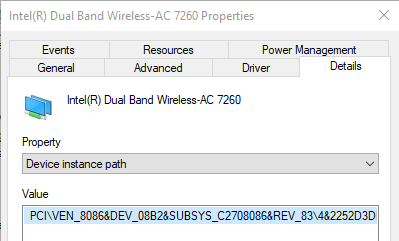
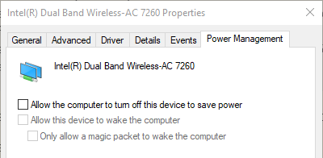

One of the most frustrating experiences with a computer is putting it to sleep, only to find it waking up as if it had been restarted. My ThinkPad T440p has guilty of doing exactly that every so often. 


_This is not what you typically expect to see when you open the laptop lid._

It breaks my flow as I keep several instances of editors open along with various constellation of tabs in several browsers and occassional shells, saving my state of _doing something_.

The straw that broke the camel's back came last week, so I fired up the Windows Event Viewer after the laptop woke up _fresh_ just like that and started to look for clues.

I went to System log, setting the priority filter to Critical or Error, and after scrolling back through the expected time after the attempted resume found the following event:

```
The computer has rebooted from a bugcheck.  The bugcheck was: 0x0000009f (0x0000000000000003, 0xffff9e8ae7a1b060, 0xffff858420037850, 0xffff9e8af9855a20). A dump was saved in: C:\WINDOWS\MEMORY.DMP. Report Id: 8fe9603b-2c25-4c53-91bf-8998e8eac811.
```

That meant that the problem was not getting to sleep, but Windows attempting to resume from it, crashing in the process and rebooting. 

As the event mentions a memory dump file, the next step was checking how to examine the said `MEMORY.DMP` file. A quick search lead me to Microsoft page https://docs.microsoft.com/en-us/troubleshoot/windows-client/performance/read-small-memory-dump-file, that explains I can use either Windows Debugger (windbg) or Kernel Debugger (kd) to read the dump files. I happened to have Windows Debugger installed along with the Windows SDK, so I fired it up and clicked *File->Open Crash Dump...*.

It also told me to enter `!analyze -v` to run analysis of this file, and after following the advice I was rewarded with a bugcheck report:

```
DRIVER_POWER_STATE_FAILURE (9f)
A driver has failed to complete a power IRP within a specific time.
Arguments:
Arg1: 0000000000000003, A device object has been blocking an Irp for too long a time
Arg2: ffff9e8ae7a1b060, Physical Device Object of the stack
Arg3: ffff858420037850, nt!TRIAGE_9F_POWER on Win7 and higher, otherwise the Functional Device Object of the stack
Arg4: ffff9e8af9855a20, The blocked IRP
```

More information followed, including a stack trace and a driver name (`tcpip.sys`)

```
SYMBOL_NAME:  tcpip!FlpWaitForMiniportToReturnTransmittedPackets+14

MODULE_NAME: tcpip

IMAGE_NAME:  tcpip.sys

BUCKET_ID_FUNC_OFFSET:  14

FAILURE_BUCKET_ID:  0x9F_3_POWER_DOWN_tcpip!FlpWaitForMiniportToReturnTransmittedPackets
```

The next command we're supposed to run is `devstack`, using the `Arg2` from the first listing, so

```
 kd> !devstack ffff9e8ae7a1b060
  !DevObj           !DrvObj            !DevExt           ObjectName
  ffff9e8b07381650  \Driver\vwifibus   ffff9e8af165fd20  
  ffff9e8af1dd7050  \Driver\NETwNb64   ffff9e8af1dd71a0  NDMP28
> ffff9e8ae7a1b060  \Driver\pci        ffff9e8ae7a1b1b0  NTPNP_PCI0015
!DevNode ffff9e8ae7a1b9a0 :
  DeviceInst is "PCI\VEN_8086&DEV_08B2&SUBSYS_C2708086&REV_83\4&2252d3de&0&00E1"
  ServiceName is "NETwNb64"
```

Now we're armed with the device specifics - vendor ID 8086 and device 08B2. 

The ID **8086** seems kind of familiar and yes, it's Intel as suspected :-) 

I have two Intel network devices on my machine - the wireless and wired adapters, and to my dismay the ID matched with the wireless one, which I use to access Internet at home.



_The VEN* and DEV* IDs match!_

This narrowed down the problem space even further and using a combination of keywords AC 7260, sleep, restart lead me to a further thread [thread](https://answers.microsoft.com/en-us/windows/forum/windows_10-power/bluescreen-when-hibernating/bb6ac5f0-af9d-4679-b930-18de56a64377?page=4) that suggested that I update Intel wireless drivers. This didn't help though, as I was already on the latest version. 

I read on a different [forum thread](https://answers.microsoft.com/en-us/windows/forum/all/shutdown-due-to-driverpowerstatefailure-bugcheck/db3c2a00-f16c-4ea0-af7b-77bd89c6627a) that similar errors may be caused by the drivers improperly handling Windows turning off the device - so I unchecked _Allow computer to turn off this device to save power_ in the Power Management tab 



Microsoft documentation on [power management setting on a network adapter](https://docs.microsoft.com/en-us/troubleshoot/windows-client/networking/power-management-on-network-adapter) mentions that:
>... [this] setting controls how the network card is handled when the computer enters sleep. This setting can be used if a driver misrepresents how it handles sleep states.

>Windows never turns off the network card due to inactivity. When this setting is checked(enabled), Windows puts the network card to sleep and when it resumes it puts it back to D0. When this setting isn't checked(disabled), Windows completely halts the device and on resume reinitializes it. This setting is useful if a network card driver says it supports going to different sleep states and back to D0 but it ultimately doesn't support this functionality.

I suspect this was exactly the case with the combination of my hardware, driver and OS.

I'm happy to report that after changing this setting the problem seems to have disappeared, with the ThinkPad happily sleeping and resuming for 6 days.

### The End