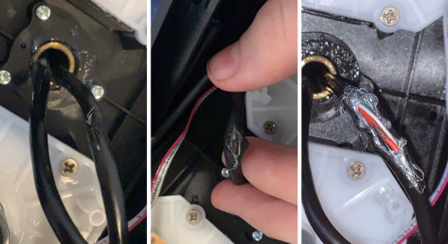

As a fan of simulator games I've also tried a couple of steering wheel setups. I've been playing [truck](https://store.steampowered.com/app/227300/Euro_Truck_Simulator_2/), [bus](https://store.steampowered.com/app/515180/Bus_Simulator_18/) and [farming simulator](https://www.epicgames.com/store/en-US/product/farming-simulator-19/home) games recently and wanted a somewhat different wheel. 

The complete kit costs 249 € new and as usual, I tried to shop around and find one at lower cost. I found a guy selling a used kit for 140 €, so I bought that one. Unpacking the big box was fun, I wiped the game controller with some ethanol (I don't like grimy or sticky stuff) and plugged it in. 

Windows includes a "Game Controllers" utility that visualizes the input state of the controller buttons and axes, Saitek controller actually consists of two separate devices: the steering wheel with pedals and the side panel.

All 25 buttons on the side panel worked fine, the little joystick as well. The pedals were squeaky, but I can fix this later as well. The analog sticks and the buttons on the steering wheel also registered fine, but the steering wheel **kept disconnecting after I turned it right**. 

After some trial and error I determined that it disconnected at a precise rotation angle - a little after being turned a full rotation. Also, when I connected the steering wheel through a USB hub, the entire hub disconnected along with the wheel, which suggested a short circuit happening somewhere. This seemed weirdly specific for a complex hardware problem, so there was a possibility of this being a simple hardware problem :-)

### Steering wheel teardown

I flipped the wheel upside down and unscrewed the 13 screws that held the bottom cover in place.

The insides were modest, most of the parts held in place with screws and some flexible. A small PCB connects the signals from the pedals, wheel, wheel buttons and thumbsticks. The wheel rotation is converted by a set of plastic gears and measured by a simple potentiometer. The USB cable goes through the hub that rotated and a similar cable comes back from the front side of the wheel (with the buttons). These two cables _(thick black on the picture)_ were the parts that moved when the steering wheel turned.

_Click the picture for a full size version_

The USB cable seemed suspicious as the insulation was broken in one place and some wires were sticking out. After removing more insulation and the shielding it turned out that one of the cable wires was stripped as well. This explained why it short circuited and disconnected the wheel after turning.

_Click the picture for a full size version_

To keep the wire insulated, I wrapped the offending red wire with some electrical tape and plugged the wheel back to computer to check whether the problem disappeared - and it did. I re-wrapped it more thoroughly, trying to produce a decent wrap that would last for a few years, replaced the cover and had a fun bus driving session in the end :-)

> I was also prepared to replace the entire USB cable, as the four wires it carried were very likely to end up in a similar PCB in the front of the wheel, but I'll save this fix for a later time.

### Happy farming!