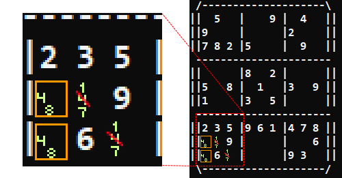

# Sudoku development diaries - part 1

I've been playing Sudoku on my phone for the past few weeks, learning new techniques and generally having fun. I thought it would be interesting to apply the playing skills in implementing a Sudoku game from scratch. I've spent several moments in analysis paralysis, oscillating between thinking of Python, JavaScript and C++, eventually settling on the latter, as it could be more portable in case I wanted to run it on a weird platform.

## Data structures

Throwing the dynamic languages out of the window, I needed to settle on some data types to represent the game board and cells. A top-down structure of `Game` -> `Grid` -> `vector<Cell *>` makes sense at a first glance. 

As the validation and other game algorithms need to work with concepts such as **house**, **row**, **column**, we provide various *view* functions on the `Grid`:

```cpp
class Grid
{
public:
	std::vector<Cell*> cells;
	Cell* GetCell(int row, int col);
	std::vector<Cell*> GetRow(int row);
	std::vector<Cell*> GetColumn(int row);
	std::vector<Cell*> GetHouse(int house);
	std::vector<Cell*> UnsolvedCells();
```

Because the computers are fast, these return a new vector of cells satisfying the condition by comparing and copying, using `std::copy_if`. As of the time of the writing, I realize it's quite wasteful and we can pre-populate some kind of row/column/house lookup, as the cells themselves never move around, only the values within them change.


Sudoku solver tries solving techniques from the easiest to the hardest. Building them and refactoring provides more convenience functions such as: 

```cpp
template<typename T>
bool contains(initializer_list<T>& list, T item)
{
	return find(list.begin(), list.end(), item) != list.end();
}

vector<Cell*> Cell::Except(vector<Cell*> cells, initializer_list<Cell*> exclusions)
{
	vector<Cell*> dest;
	copy_if(cells.begin(), cells.end(), back_inserter(dest), [&](auto c) {return !contains(exclusions, c); });
	return dest;
}

std::vector<Cell*> Grid::GetColumn(int col); // as described above
```

In order to obtain "all cells in a column without these two candidates":

```cpp
auto columnCells = Cell::Except(grid->GetColumn(option->col), { option, other });
```

Maybe I'm trying to write Python in C++, as I feel there should be a more idiomatic way on how to do things.

## Loading the grid

Since I don't have a working puzzle generator (as it would probably require a working solver), I'm loading the puzzles from a text file in the simplest format I thought of - the puzzle grid as numbers.

```
 5   9 4 
9     2  
7825   9 
   8 2   
5 8 1 3 9
1  3 5   
235961478
  9     6
 6    93  
```

## Seeing the grid

The first visualization I implemented was a text-mode grid, listing just the discovered and blank cells, separated by ASCII pipes and dashes.

```c
 /--------------------\
||  5   |    9 |  4   ||
||9     |      |2     ||
||7 8 2 |5     |  9   ||
 ----------------------
||      |8   2 |      ||
||5   8 |  1   |3   9 ||
||1     |3   5 |      ||
 ----------------------
||2 3 5 |9 6 1 |4 7 8 ||
||    9 |      |    6 ||
||  6   |      |9 3   ||
 \--------------------/
```

While it fits the basic use case (to see the grid), it's troublesome to see the hints/notes for individual cells though, so I just listed them on the next lines along with the coordinates.

```
Notes for (0, 1):
Notes for (8, 0):1 3 7
Notes for (8, 8):1 2 5
```


I've prototyped a larger text based layout, that would lay a single cell at a 6x3 character grid (7x4 including borders), which would mean we need at least 63x36 characters - but I didn't want to get too deep into the text UI rabbit hole as I'd eventually like to make a console or web-based port.

```
---------------------
|  5   | ---- | ---- |
|9     |   /  ||___  |
|7 8 2 |  /   | ___/ |
----------------------
```

I also didn't implement any kind of player controls yet - so there's no way to enter a number to progress the control

## Building the solver and hint system

So far it seems that the puzzle solver, hint mechanism and future grid generator can be powered by the same logic. An individual solver/hint step can be described by the following structure _(which is likely to be expanded for more complex techniques)_:

```cpp
struct HintData{
	bool success;
	Cell* cell;
	string name;
	string message;
	int valueToHighlight;
	vector<Cell*> cellsToHighlight;
	map<Cell*, set<int>> eliminationCandidates;
}
```

An individual hint, applied to the Sudoku puzzle displayed earlier, can be described in the early development as text:

```
Hint:Naked pair
These cells can only be 4, 8 as they are the only two in the house.
Affects cells at: (0, 7) (0, 8)
Elimination candidates:
(0, 3): 4
(2, 8): 4
(1, 7): 4
```

Which, visualized, would look like this:



The way we find this hint (naked pair) is to apply the same logic I as a human would use:

```
for every house:
  find cells with exactly two possibilities
    find other cell with the same two possibilities
    if found:
      check if we can eliminate anything from this house
      if these cells form a column:
        check if we can eliminate cells from the entire column
      if these cells form a row:
        check if we can eliminate cells from the entire column
      if any elimination candidates:
        success
```

These larger steps hint at a helper functions that can be extracted and named, such as `cellsWithNOptions`, `Cell::SharesColumnWith`, or `AddEliminationCandidates`.

The logic for most of these filter/find functions is probably not very optimal idiomatic C++ - as I throw a lot of `vectors` around, with entries copied with `std::copy_if` and a predicate function. 

## What's next

I'd like to get some kind of GUI up and running so the game board can be interactive, ideally as painless as possible during the prototyping stage.