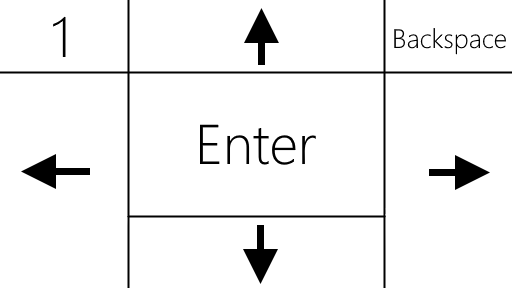
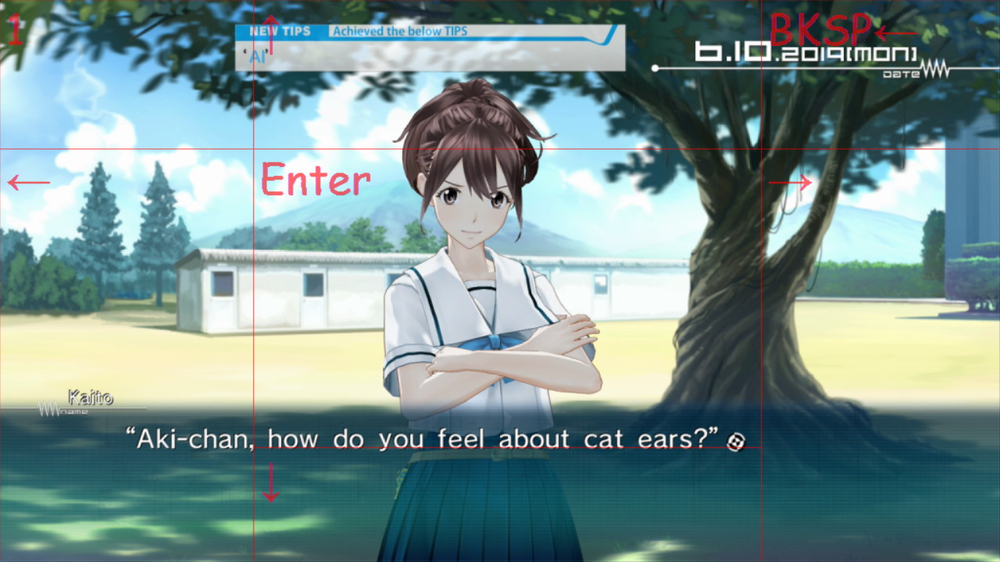

# Rolling your own on-screen keyboard

I wanted to play the [Robotics;Notes](https://en.wikipedia.org/wiki/Robotics;Notes) visual novel on my Windows touchscreen tablet, but unfortunately the game only supports keyboard controls. While connecting a hardware keyboard is an option, it's kind of impractical to play a game in the bed that way.

Visual novels don't require a lot of input, as te gameplay consists of reading text, so it's mostly pushing the same button over and over in order to advance the dialog and some auxillary controls used to save/load game.

While pretty sure that somebody must have implemented virtual keyboard with a nice overlay already, it sounded like a tiny evening project, which should have been  simple to implement using off-the-shelf libraries.


After considering the in-game help I came up with the following layout for the essential keys:



### Dev stack

I'm using my favorite development environment - Visual Studio 2019, with Windows project using C# and .NET Framework. We can decompose the problem into two subproblems:
- capture mouse clicks
- emit keyboard events


## Capturing mouse (touch) events

I've divided the screen the screen into portions using ¼ of the screen width or height as a measure. 
Converting this into code was very straightforward - checking for the boundaries of the ¹/₁₆-th of the screen.

```c#
if (x < screenWidth / 4)
{
    if (y < screenHeight / 4)
        return Keyboard.DirectXKeyStrokes.DIK_1;
    else 
        return Keyboard.DirectXKeyStrokes.DIK_LEFT;
}
else if (x < (screenWidth / 4 * 3))
...
```

I plugged this into the output of the [EventHook](https://github.com/justcoding121/windows-user-action-hook) library, which supplies a `MouseWatcher.OnMouseInput` event with event type (we're interested in `WM_LBUTTONDOWN`) and the `x` and `y` coordinates.

This could be configured for another games by configuring a different input regions, but following the [KISS principle](https://en.wikipedia.org/wiki/KISS_principle) it seems easier to program them in by changing the tool source than inventing some kind of fancy configuration file.

## Simulating the keyboard input

I've originally used the [InputSimulator](https://archive.codeplex.com/?p=inputsimulator) NuGet package which worked in a test scenario, but not in the game.

I had to swap it out for DirectX keystroke sender as per [this StackOverflow answer](https://stackoverflow.com/a/55673116) by [DreTax](https://stackoverflow.com/users/5033623/dretax).

To make the game happy, I inserted a slight delay between the _key down_ and _key up_ events 

```c#
Keyboard.SendKey(key, false, Keyboard.InputType.Keyboard);
Thread.Sleep(15);
Keyboard.SendKey(key, true, Keyboard.InputType.Keyboard);
```

A final touch was a configurable screen resolution over an application property file to allow it to match the resolution of the game, which was different than the regular screen resolution.

## A nice touch: Overlay display

WinForms applications can be made into "overlay" apps relatively easily. According to [this StackOverflow answer](https://stackoverflow.com/a/173800) we should be using `WS_EX_TRANSPARENT` flag to pass through mouse events to the window underneath. To make the window stay on top, let's use its `TopMost` property and finally the `TransparencyKey` to make entire color transparent.

Then according to the button configuration I just drew gridlines with the letters and tweak the opacity until it works as expected.

```csharp
void PaintOverlayBox(Graphics g, Rectangle rect, string text)
{
    g.DrawRectangle(borderPen, rect);
    g.DrawString(text, textFont, textBrush, rect);
}

...

int width4 = this.Width / 4;
int height4 = this.Height / 4;

PaintOverlayBox(e.Graphics, new Rectangle(0, 0, width4, height4), "1");
PaintOverlayBox(e.Graphics, new Rectangle(0, height4, width4, height4 * 3), "←");
PaintOverlayBox(e.Graphics, new Rectangle(width4, 0, width4 * 2, height4), "↑");
```

This is how my new virtual keyboard looks in the game in all its glory:


