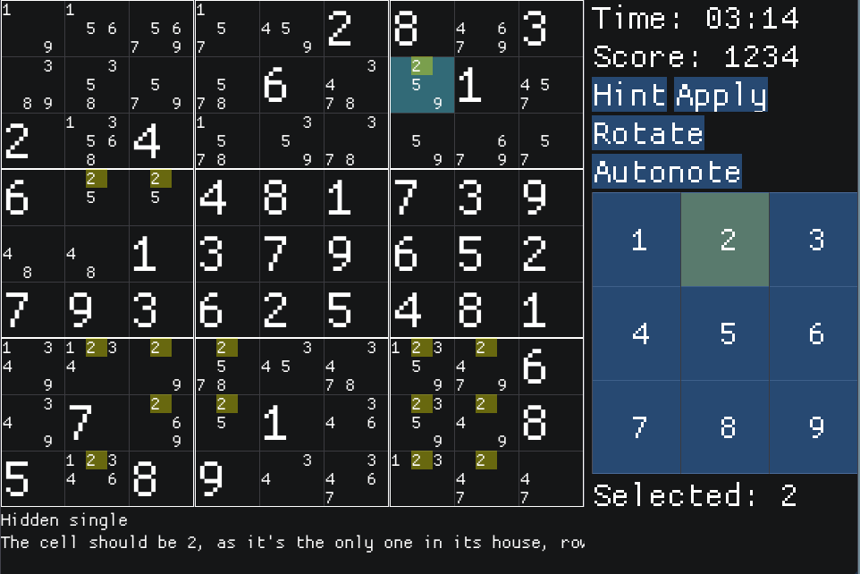
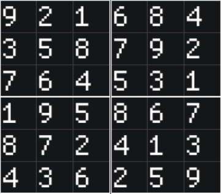
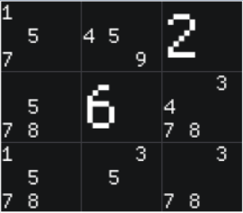

After developing the basic parts of a Sudoku game in text mode, I was looking for UI toolkit to make it playable with a mouse. After checking various options for a while I ended up using 
[Dear ImGui](https://github.com/ocornut/imgui). 

See also [Sudoku development diaries - Part 1]() for more information about the core functionality.

### Immediate vs retained GUI

Most of the GUI frameworks I've worked with are [retained mode](https://en.wikipedia.org/wiki/Retained_mode), where the graphics library retains the object model (the scene) to be rendered, and the API calls make changes to the resources retained by the library. The framework itself handles the drawing, buffering and visibility.

In contrast, the [immediate mode GUI](https://en.wikipedia.org/wiki/Immediate_mode_GUI) is more direct as the UI is drawn every single frame, recreated via function calls every time. There is no object model to speak of, hit testing is usually primitive, but it's simple to work with.



## ImGUI and Sudoku

I took ImGUI example and started building out the game view. It was really a breath of fresh air as I banged out the initial UI in about 30 minutes and was able iterate and expand rapidly. 

I eventually settled on scaling everything by a constant factor to make it more usable on a PC.

> Notes on the tech stack: Developing in Visual Studio 2019 on Windows, I based the window on the standalone [ImGui example](https://github.com/ocornut/imgui/blob/master/examples/example_win32_directx9/main.cpp) for DirectX 9

There also needs to be some "global" state sprinkled around, which doesn't fit into the game state itself, for example which number is currently selected. It makes sense to group the state into two categories - **core game state** and **game UI state**. The things that belong to the game UI state are for example the currently highlighted cell, a currently displayed hint, time passed and such, that don't feel that they should exist in the main state that contain the game board and cells, but I may be wrong about this.  

The game grid layout consists of *tables within tables within tables*. In order of outside in:
1. game grid containing 3x3 houses
2. a house containing 3x3 cells
3. (optional) a cell containing 3x3 candidates

### Laying out the basic grid

In the first iteration I started by displaying the known/solved cells. 

When the cell is *solved*, either by being fixed from the puzzle definition or solved by the player, we display it as a single number. In addition, the fixed cells should not be changeable. Making things not clickable is just a matter of using `ImGui::Text` instead of `ImGui::Selectable`.


_The grid with some houses with all of their cells solved_

### Laying out the cell options

The inverse state of a *solved* cell is to be *unsolved* - in which case we display a miniature 3x3 grid of candidates / options instead of the bigger number representing the cell value. We also want some options to not appear in case they are invalid, or some other to be highlighted or rejected by the player.



### Handling input

Handling clicks is straightforward and just needs including the "click handler" code after a conditional of the clickable control:

```c
if (ImGui::Button(buf, ImVec2(35 * sudokuScale, 35 * sudokuScale))) {
    currentlySelectedNumber = num;
}
```

That's it - no dispatch calls or complicated updates. Because we know that the UI **will** be re-rendered on the next frame, let's just modify the game and UI state, as the GUI is a function of the game state. We can use the same way to issue hints

```c
auto hint = solver.Hint(&(game.grid));
currentHintData = hint;
```

### Formatting the widgets

To account for formatting a single display item in multiple ways, the various states are handled are with simple `if` statements, showing various states for the Sudoku cell:

```c
if (option == currentlySelectedNumber) {
    ImGui::TableSetBgColor(ImGuiTableBgTarget_CellBg, color_highlight);
}
if (currentHintData.eliminationCandidates.count(cell) && currentHintData.eliminationCandidates[cell].count(option) > 0)
{
    ImGui::TableSetBgColor(ImGuiTableBgTarget_CellBg, color_hintEliminationCandidate);
}
if (cell->crossedOutHints.count(option)) {
    ImGui::PushStyleColor(ImGuiCol_Text, color_darkred);
}
```

A similar logic is applied for highlighting the score and hint labels. 

## What's missing

The most important thing that's still missing is the **puzzle generator**. There are well documented algorithms on doing so, which basically involve the following steps:

- Generate a valid full grid of numbers (that satisfies the Sudoku rules)
- Remove a random value at a time and see if the solver can still solve the grid 
    + Here we can have different solver configurations based on the _difficulty_
    + if yes, remove another value
    + if not, backtrack and try something else

It would also be cool to make a WebAssembly demo to include with the post. 