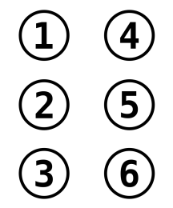

My visually-impaired friend asked me for help in developing a conversion tool for the Slovak text into the Braille code. 

The idea was to convert the text into an equivalent Unicode [Braille pattern](https://en.wikipedia.org/wiki/Braille_Patterns). These could be further utilized, for example by 3D printing them into tactile signage.

The final result as an interactive convertor:

{}

#### Braille

Braille alphabet consists of **dots**, which arranged in various patterns form **cells**. The cells represent a letter, a number or a punctionation mark. 

Although Unicode supports 8-dot Braille cells, Slovak Braille only utilizes 6-dot cells, making our job slightly easier. 


_The six dots in a Braill cell_

Please find various representations of letter `h` in the following table:

Letter | h
|-|-|
Braille symbol | ⠓
Unicode character | U+2813
Name | BRAILLE PATTERN DOTS-125

This means that to convert letters into their Braille representation in JavaScript, we need a conversion table, similar to the following:

```js
{
    "a": 0x2801,
    "á": 0x2821,
    "ä": 0x2808,
    "b": 0x2803,
    "c": 0x2809,
    ...
}
```

#### Lower case

Using just the mapping table, we can solve the **lower case** letters, as we can map them now in a straightforward manner, but we still have **numbers** and **upper case** to deal with.

> There are also a few symbols that are representes with multiple cells, such as % (⠼⠏) and @ (⠼⠻)

#### Numbers

In both the numeric and upper case sequences, we need to use Braille formatting marks. These are the number sign ⠼ and the capital sign ⠠, which immediately precede the sequence they modify. The sequence then gets either terminated by another formatting mark or a white space.

In case of **numbers**, we need to find the sequence of numbers that is terminated either by a letter or a space and prefix it with the ⠼ _number sign_. If it's not terminated by a space, append the _prefix end_ ⠰.

Every number of the sequence gets looked up in the conversion table. Digits `1`, `2`, `3`, through 0 are encoded as characters `a`, `b`, `c` through `j`, as the number sign ⠼ changes the meaning of the cells that immediately follow it.

#### Upper case

Similar to the number sequence, we need to find a longest unbroken upper case sequence, prefix it with the ⠠ _capital sign_. If the sequence is followed by a lower case letter, we end the sequence with a  _prefix end_ ⠰.

Every character of the upper case sequence is turned into its lower case variant and encoded via the lookup table.

#### Putting it all together

The rest is just consuming input text in a loop, checking for sequences of numbers, upper case letters, or handling everything else by a lookup table. into sequences of 

### Links

The tool is in [production](https://www.skn.sk/prekladac/), used by the [Slovak Authority for the Braille Code](https://www.skn.sk/novinky/slovak-authority-for-the-braille-code).

The repository of the translator on [GitHub](https://github.com/jborza/slovak-braille).