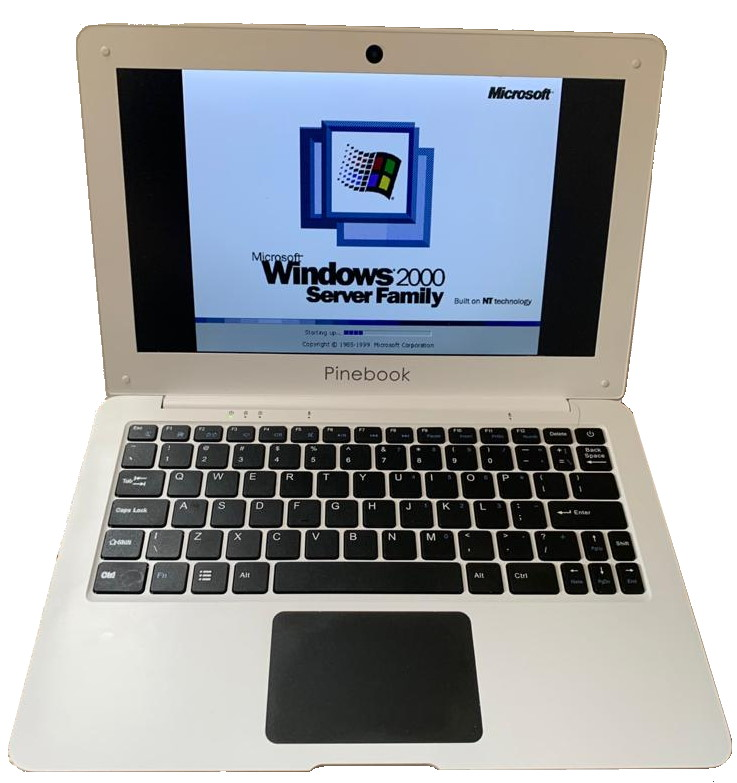
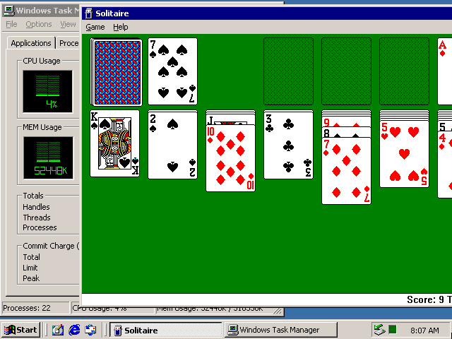

I thought it would be fun to run Windows 2000 on a [Pinebook](https://www.pine64.org/pinebook/) - a nice little ARM-powered laptop. As there is no version targetting this architecture, we have to use an emulator. [QEMU](https://www.qemu.org) is a nice free choice to run on Linux, and it supports the combination we need, which is i386 guest on an aarch64 host.

I am running the Manjaro Linux distribution, so I had to install `qemu` and `qemu-arch-extra` packages. Another option is to build QEMU from [sources](https://www.qemu.org/download/#source) on your own with the `--target-list=i386` option).

### Windows 2000 installation

First create a virtual hard drive with:

```bash
qemu-img create -f qcow2 <hard drive file> 2G
```

Then run the emulator, attaching the virtal hard drive, installation media, specifying 256 MB RAM, with sound and a network card. 

```bash
qemu-system-i386 -hda <hard drive file> -cdrom <ISO> -m 256 -boot c -vga cirrus -net nic,model=rtl8139 -net user -usb -device sb16 -localtime 
 ```

> If you don't want network, omit the `-net` parameter set.

### Running it

After the system has finished installing, we don't need to attach the installation CD-ROM media anymore:

```bash
qemu-system-i386 -hda <hard drive file> -m 256 -boot c -vga cirrus -net nic,model=rtl8139 -net user -usb -device sb16 -localtime 
```



### Performance

It's kind of awful. Windows 2000 takes around 5 minutes to boot on Pinebook 1080p from the internal storage. The emulated CPU usage was hovering around 100% usage, and the RAM usage was 130 MB. However, once the system is running, we can help the system a bit by disabling and stopping the system services we won't need. If you know the VM won't be connected to the network, we can disable a lot of network-related stuff, such as DHCP client, Computer Browser, etc. 

The memory usage (reported by Task Manager) after disabling almost everything went down to 59 MB and CPU was freed enough to play Solitaire and Minesweeper :-). 

This entire setup is much faster on the Raspberry Pi 400.

We also have to keep in mind that the A53 core in Pinebook is an ancient design from 2012. 



### Useful shortcuts
- CTRL+ALT+F for full screen
- CTRL+ALT+2 for QEMU monitor, then type `sendkey ctrl-alt-delete` to invoke the ctrl-alt-delete login key combination
- CTRL+ALT+G to turn off mouse grab (so you can move the cursor away from the QEMU window)

### Copying stuff to and from the VM

One way is to spin up an HTTP or FTP server on the the host machine, then download zip packages through the browser.

To transmit more files out of the VM I've used another technique - mounting a VMDK image as a second disk to the virtual machine (`-hdb second.image`), then created an FAT32 partition inside the VM with the Disk Management tool. Then I copied the files to the new drive, shut down the VM and mounting the image in the host OS to copy the files off the virtual disk.

> Qemu documentation says it also provides a file share: `-net user,smb=/absolute/path/to/folder` - see this [stackexchange post](https://unix.stackexchange.com/questions/165554/shared-folder-between-qemu-windows-guest-and-linux-host), but I couldn't get it to work.


See also: 
- [The official guide](https://wiki.qemu.org/Windows2000)
- [post on Computer History Wiki](https://gunkies.org/wiki/Installing_Windows_2000_on_Qemu)