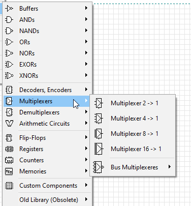
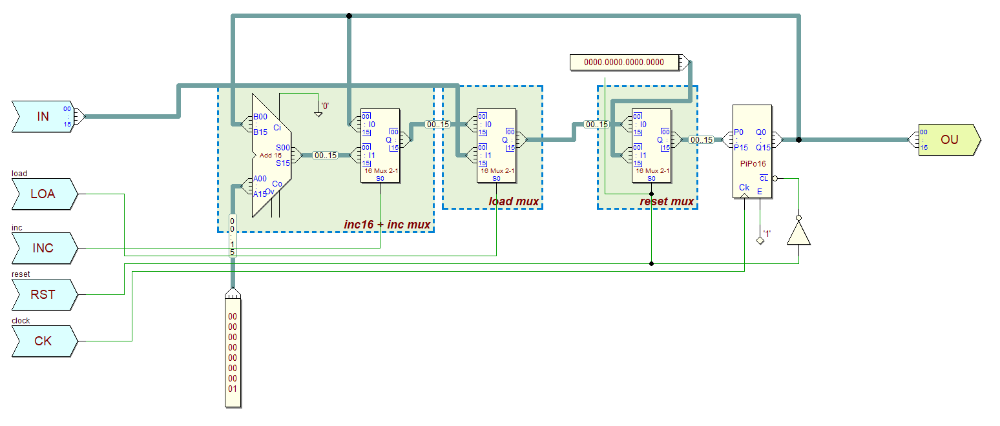
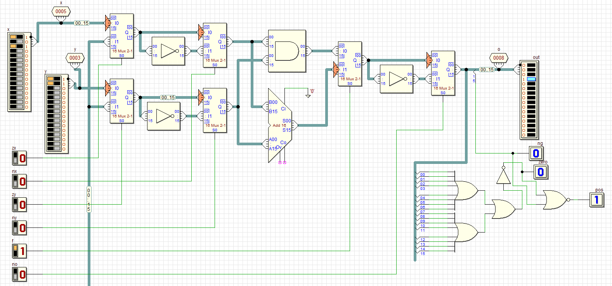
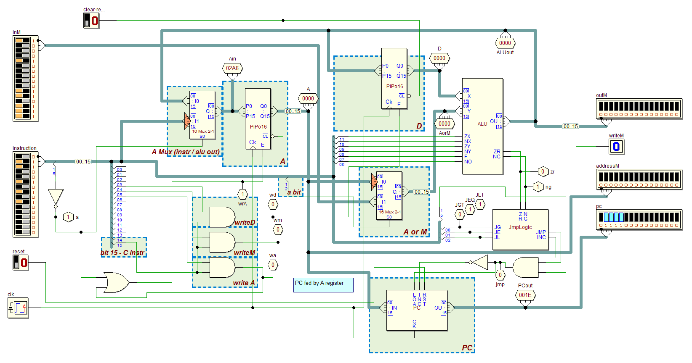
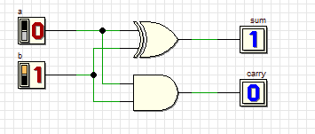
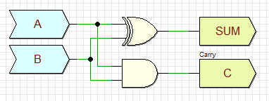

#### I like it when software is fun to use, and Deeds is fun!

While playing around and doing the exercises from the the [nand2Tetris](https://www.nand2tetris.org/) course I've ended up discovering an awesome software for digital circuit design - [Deeds](https://www.digitalelectronicsdeeds.com/index.html), created by Giuliano Donzellini from University of Genoa. 

Although the `nand2tetris` course comes with its own [software](https://www.nand2tetris.org/software), which includes a hardware simulator for its own hardware description language, I wanted to implement the individual components and the Hack computer system in a "visual" design software as well.

**Deeds** (which stands for **D**igital **E**lectronics **E**ducation and **D**esign **S**uite) allows you to lay out the components on a grid, connect them by wires and buses. There's a library of pre-made components, such as basic logical gates, muxes, memories and registers. It includes a simulator, where you can advance the clock manually or have it tick on its own.

The software is very snappy and amazingly memory-efficient, as the individual Deeds instances consume around 4.5 MB of RAM on my machine.

In addition to the features described in this article, Deeds also includes a Finite state machine simulator and an 8-bit computer simulator for the [DMC8](https://www.digitalelectronicsdeeds.com/guide/DocDMCE/dsystemguide.html) fantasy/education CPU.

Deeds can also generate VHDL from your design, which makes it easy to load the design to an FPGA, but I haven't tried it myself so far. 

### What did I build

I've ended implementing the entire Hack CPU from  nand2tetris, built out from its individual components, all the way from simpler stuff (gates, multiplexers, demultiplexers) to ALU, PC register and the CPU itself.

_Program counter component with its control input pins_

_Arithmetic logic unit in the simulation mode, with tracepoints for debugging_

_Hack CPU with annotated regions_

### Deeds vs nand2tetris HDL caveats:

Some caveats in comparison to Nand2Tetris, as the HDL of Nand2Tetris is simplified:

- Registers have CL, Ck, E pins. It seems that E stands for Enable, Ck is clock signal and CL is the inverted clear bit  (as signified by the dash above CL).

- RAM chips have CK, WE, CS pins. CK is clock, WE seems to be write enable (set it to high to enable), CS may be chip select? When CS is set to low, the RAM chips output zeroes.

- I've also found it handy to route a clear signal to the registers and RAMS during a start of a simulation session.

### Reusable components in Deeds

We can also make our own reusable circuit element. First, one needs to switch to a new Deeds mode - `File->New Block`. Instead of using regular inputs/outputs then just use block inputs/outputs. Fortunately it's possible to develop the component in the Circuit mode with all of its nicer interactions and copy/paste to the Block mode.

It took me a bit of time to figure out how to load the block to a different design - it's Circuit->Components->Custom Components->Circuit Block Element (CBE) and then pick a CBE file you created in a previous step.

> Note that this is very similar to structural mode of VHDL, where we connect individual components by pins.

_Component mode, with interactive toggle outputs and display_

_Block mode, which can be inserted into other designs as a subcomponent_

### Conclusion

The documentation is adequate, with a multitude of demos and [learning materials](https://www.digitalelectronicsdeeds.com/learningmaterials/labtopics.html)

As a tool designed as a learning environment or digital electronics, it really hit the mark. As a beginner in electronics, I was extremely pleased by Deeds when working through the nand2tetris exercises, and again when revisiting it while writing this blog post.