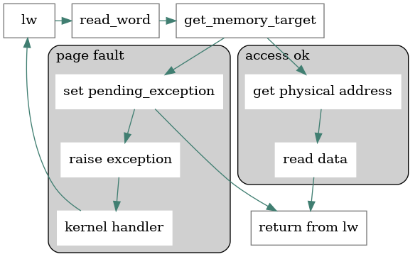

I've fixed two more bugs in the RISC-V emulator recently, both related to [memory paging](https://en.wikipedia.org/wiki/Memory_paging). The first one was caused by only supporting a one third of the possible page faults, the second one was closely related to page faults as well.

## Load / store / fetch page faults

Virtual memory with its page table allows the operating system to store a mapping between _virtual_ and _physical_ addresses. It also allows the _virtual_ addresses **not to backed** by a physical memory until needed.

When that happens and the program attempts to operate on a memory address that's not currently loaded, the **page fault** process occurs.



In my implementation, when we try to determine a memory target (could be physical or virtual depending on the memory mode), we walk the page table and check if it knows the virtual address. If it does not, we raise a page fault exception, store the current PC value and jump to the exception handler (somewhere in the kernel pointed to by the `CSR_STVEC` register).

The trouble was that I have initially only reported  `CAUSE_LOAD_PAGE_FAULT` to the OS, but it expects two other causes: `CAUSE_STORE_PAGE_FAULT` that happens if we attempt to **write** a memory, and `CAUSE_FETCH_PAGE_FAULT` when an instruction is to be executed from a page not loaded yet.

The latter is especially important when running user-mode programs as the kernel itself is loaded into the memory by a bootloader. 

The fix was reasonably simple:

```c
int get_memory_target(State* state, uint32_t virtual_address, enum access_type access_type, MemoryTarget* target) {
	uint32_t physical_address;
	int result = translate_address(state, virtual_address, access_type, &physical_address);
	if (result == PAGE_FAULT) {
		if (access_type == LOAD)
			state->pending_exception = CAUSE_LOAD_PAGE_FAULT;
		else if (access_type == STORE)
			state->pending_exception = CAUSE_STORE_PAGE_FAULT;
		else //fetch
			state->pending_exception = CAUSE_FETCH_PAGE_FAULT;
		state->pending_tval = virtual_address;
		state->has_pending_exception = 1;
		return result;
	}
	return get_memory_target_physical(state, physical_address, target);
}
```

### Load word with the same source and destination register

The second bug was uncovered by introducing load page faults, which manifested itself when busybox crashing was trying to start. Something strange was happening during the process, as it tried to load data from a garbage address (`0xFFFFFFFF`), so I fired up the disassembler and found that `lw` was the offending instruction:

```gas
(emuriscv) dr pc 11
1800bc:	0007a783          	lw	a5,0(a5)
```

The `lw rd, offset(rs1)` instruction is supposed to load a word (32-bit in the case of 32-bit rv32 instruction set) from an address that's calculated as the value of `rs` + `offset`.

The original implementation did just that, in a sequence:

```c
void lw(State* state, uint32_t* instruction){
	int32_t offset = get_i_imm(*instruction);
	uint32_t address = get_rs1_value(state, instruction) + offset;
	uint32_t value = read_word(state, address);
	set_rd_value(state, instruction, value);
}
```

#### What went wrong

After putting a breakpoint to this instance of `lw` I found that the instruction `lw	a5,0(a5)` had trouble working when the source and destination registers were the same (`a5` into `a5`).

When a load page fault got triggered by the `read_word` call, the naïve implementation overwrote the destination register with a dummy value. As `read_word` caused a side effect and the page fault got caught, handled, dispatched to the kernel to load the page, the control got returned back to this exact instruction. But as `a5` was already overwritten by a garbage value returned from the `read_word`, the original value was already lost. 

#### The fix 

The fix was to return early from the `lw` (and `lh`, `lhu`, `lb`, `lbu`) instructions in case the memory read caused a pending exception.

```c
	uint32_t value = read_word(state, address);
	//if there is pending exception, abort and don't write RD as we may clobber the register if RD == RS1
	if (state->pending_exception)
		return;
	set_rd_value(state, instruction, value);
```

Both have been fixed in these commits: [lw](https://github.com/jborza/emuriscv/commit/8f0e86386096883652d0373ce217ad8579f80460) [pagefaults](https://github.com/jborza/emuriscv/commit/e3c9df8fe595141107ca21d67e2ae278622584c7)