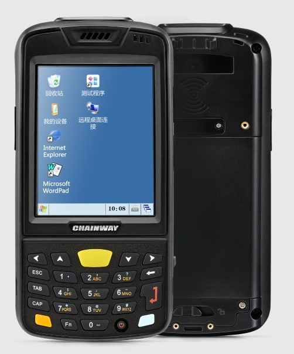
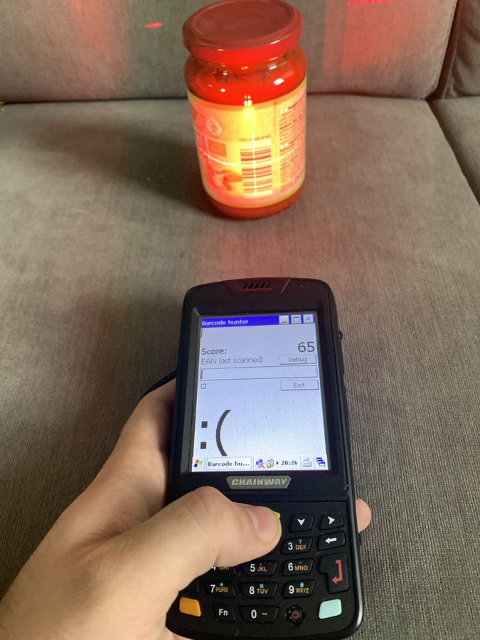

I like doing small projects and one-off games for my kids, and I've recently acquired a handheld industrial PDA with a barcode scanner that suggested an idea of a barcode-scanning game. It was quite successful, as it kept my son busy for a while hunting down everything with a barcode on it at home :).

## The hardware

The specific model is [Chainway C3000](https://www.chainway.net/Products/Info/8), which runs Windows CE 6.0, has a 3.5" QVGA (240x320) display and a 4 GB of flash memory. Fortunately it also features a reasonably fast Cortex-A8 CPU clocked at 800 MHz paired with 256 MB RAM, so it's the fastest Windows CE/Mobile device I've played with. On the physical side, this device is really bulky compared to the modern smartphones, as it's 3.1 cm (1.22 in) thick and weighs 330 g! The screen is resistive, so the device comes with a stylus.

## Game development

I usually use a retro computer for retro stuff, so I dusted off the Thinkpad T41 with Windows XP and Visual Studio 2008, and set up a new C# Smart Device Project. 

The UI design is simple, a huge emoji depicting success or failure of the last scan occupies the biggest portion of the screen, accompanied by a big score display. Making a form-based game in Visual Studio 2008 feels very familiar and the drag&drop visual designer works well for a fixed screen size application. 

I've considered having an option to enter the product name after the barcode was scanned, but that would probably sour the hunting game and turn it into doing unpaid inventory work, so I skipped this and just [kept track](https://github.com/jborza/barcode-hunter/blob/master/DB.cs) of the barcodes scanned in a hash set, serializing it to the storage after each new barcode was found, so the state persists after game restarts. 

Entering the barcode is done by having focus in a text field and pressing the yellow _Scan_ button. That causes a helper application (by the manufacturer) to intercept the keypad event of the big yellow button is pressed, then start the scanning process in the hardware and reports back the result as a series of key events with a configurable prefix / postfix. This way the EAN code can be followed by a tab or a new line, depending on the logistics application used. In my case, I've used the newline configuration and intercepted the `Keys.Enter` in the `textbox_KeyPress` event to check the new barcode.

_The game in action_

Finally, when the game worked well enough in the emulator, I wanted to test it on the real device. Because I've misplaced the charging cradle I could not connect the PDA to the Visual Studio and deploy over USB, but it was possible to send the file over Bluetooth and just run the executable from the device's File Explorer. This feels a bit nicer than installing the app on contemporary mobile platforms.

There was also a slight blocker with sounds, as I wanted an audible feedback to indicate whether the player found a fresh barcode. It seems that making beeps isn't really exposed in the .NET Compact Framework, so I've called into the `MessageBeep` function as suggested by [this stackoverflow answer](https://stackoverflow.com/a/476332). 

[The code](https://github.com/jborza/barcode-hunter) is available on GitHub, as usual. 