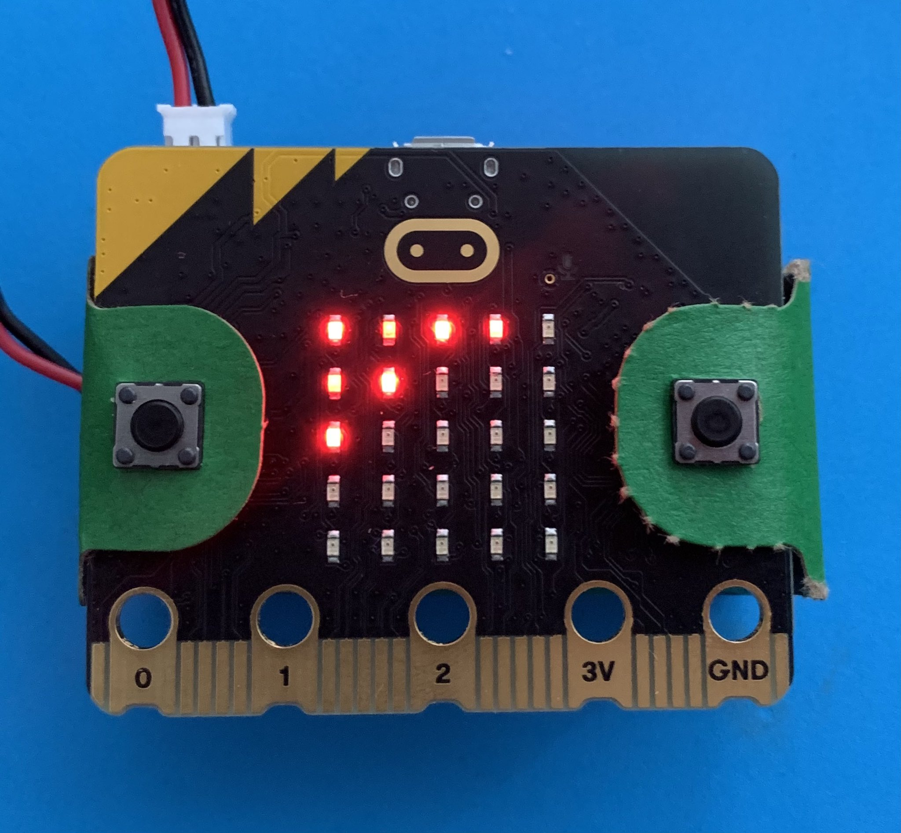
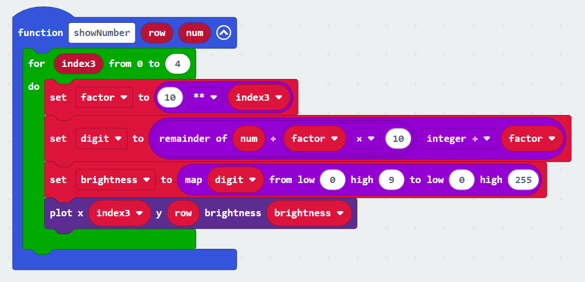
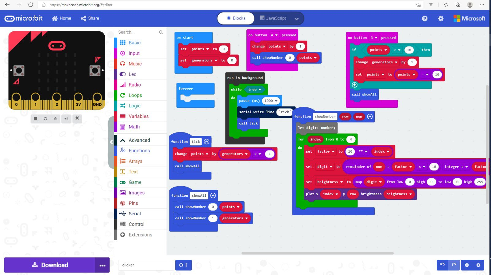

I often chat with my son about computer games on the way to the school in the morning. One topic that comes up fairly often are the incremental games, which we both like and enjoy in various forms - I usually play browser-based ones and my son plays similar ones in Roblox. 

#### Incremental games?

The thing about the incremental games is not trying to destroy the mouse, but discovering new strange game mechanics. In the most intricate examples of the genre, such as [Kittens Game](https://bloodrizer.ru/games/kittens/), one has a variety of resources influencing each other, or you get a complete paradigm shift, for example in [Universal Paperclips](https://www.decisionproblem.com/paperclips/index2.html). In the simpler ones, you just get money and buy more upgrades, that make more money, such as in [Adventure Capitalist](https://store.steampowered.com/app/346900/AdVenture_Capitalist/). Check out the [incremental_games subreddit](https://www.reddit.com/r/incremental_games/) for more. 

> However not all is sunshine and roses, there are many incremental games with _dark patterns_, trying to get players addicted to the little rewards and exploit them for paid upgrades.

#### Making my own

So that morning I've come up with a minimalistic incremental game for the micro:bit. Keeping in mind the constraints of the device, we have two buttons and 5x5 LED screen to work with. 

That means the only two buttons you have are the _click_ and _buy all_ actions. You _click_ to get points, then _buy all_ of the upgrades. The upgrades are generators that generate points (or lower level generators). 

> It's obviously nothing new, as this kind of progression has been made popular have been popular some 6 years ago with [Swarm Simulator](https://www.swarmsim.com/) and later [Antimatter Dimensions](https://ivark.github.io/). 

#### Gameplay

So at first you click 10 times to be able to buy a level 1 generator. Every level 1 generator will generate 1 point per second. After a while you'll be able to afford a level 2 generator, that produces level 1 generators, and so on. Then the growth picks up really fast, and you'll be able to get a level 4 generator soon enough.

<video controls>
    <source src="game.mp4" type="video/mp4">
</video>

#### Making it fun

This is the hardest bit with these (and all) kids of games, as the game designer needs to tweak the multipliers, upgrade costs and other variables so there's a constant working effort/reward balance. I suppose the right way to go is to have a steeper formula for the later generators, so the game is not over in five minutes.

#### Try the HTML version:

{}

#### Development for the micro:bit

I've fired up the [MakeCode](https://makecode.microbit.org/#editor) studio and started throwing aroud the prototype. Most of the variables are global, so I created global `points` and `generators`, and incremented points on pressing the `A` button. 

We needed a way to display largish numbers on the micro:bit screen, so I've come up with having one number per row, the dot brightness representing digits from 0-9.

The rows are numbers (points, level 1-4 generators), columns display digits with varying brightness, so the digits are actually laid out in reverse - number 1234 is displayed as 4321.

So the following photo shows something like 2914 points, 63 level 1 generators and 3 level 2 generators:



The development environment is a visual one, where you arrange blocks of code into sequence, or place them within larger blocks that denote functions, loop bodies, just like in regular programming languages. Real programmers might roll their eyes backward at dragging blocks around, but although some things are a bit verbose:

```js
generators[idx] = generators[idx] + 1
//a block equivalent
(generators) set value at (idx) to ((generators) get value at (idx + 1))
```

At least for simple programs, seeing what executes after a button press, what's timer triggered and so on is neat.

You can switch between Blocks, JavaScript and Python, but I persisted and finished the game in Blocks. The hardest bit was the digit display function along with its JavaScript equivalent:



```js
function showNumber (row: number, num: number) {
    for (let index = 0; index <= 4; index++) {
        factor = 10 ** index
        digit = Math.idiv(num % (factor * 10), factor)
        brightness = Math.map(digit, 0, 9, 0, 255)
        led.plotBrightness(index, row, brightness)
    }
}
```

I've also used a `run in background` block as a timer to generate the rewards, everything else is just straightforward linear event-based code with boring loops and conditionals. The environment also fortunately supports arrays, which are useful for storing the amounts of generators.

The development environment also features a micro:bit simulator with a working debugger, a way to upload the compiled binary to a physical device over the USB port, which, for a browser IDE is pretty cool. There's also a GitHub integration is neat, with a visual diff showing what items in the blocks were changed/removed. 



> The source is available on [GitHub](https://github.com/jborza/microbitclicker)